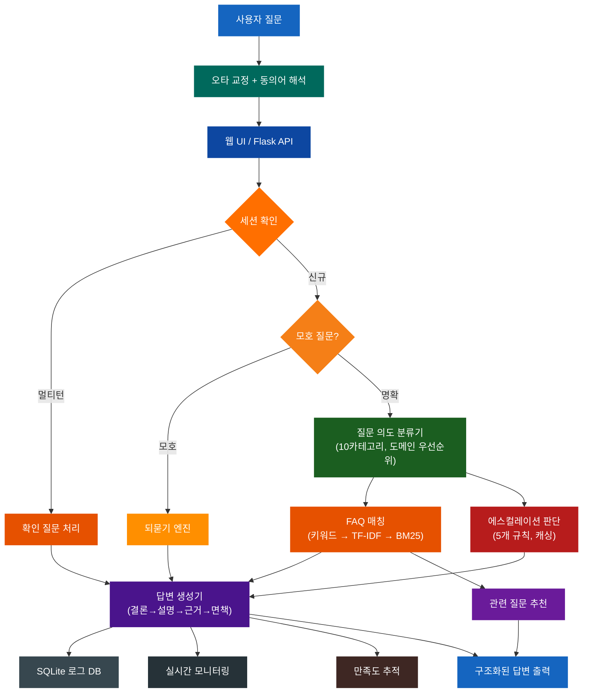
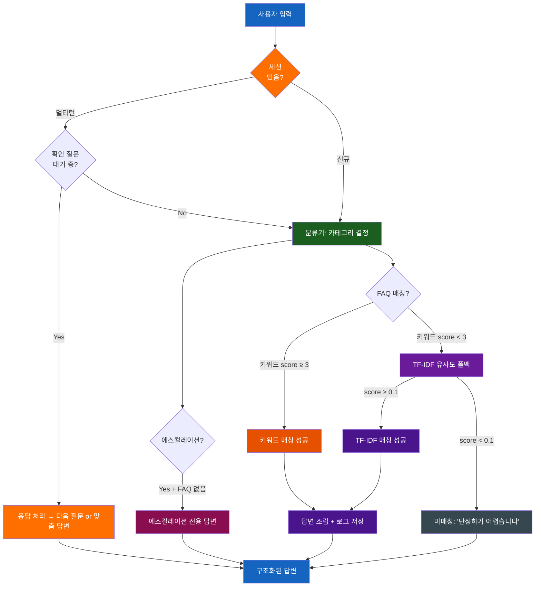
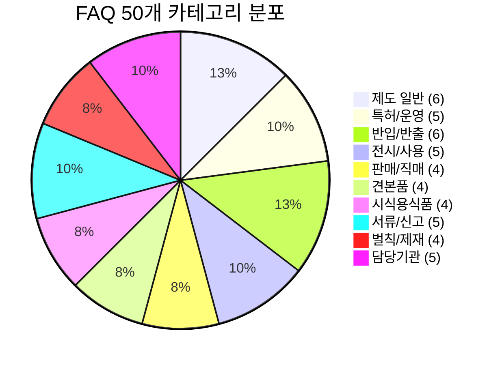
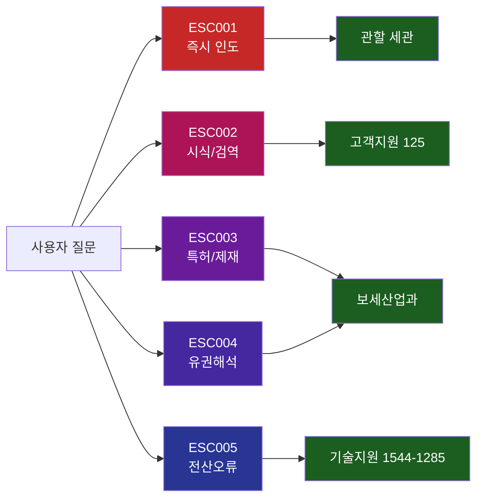
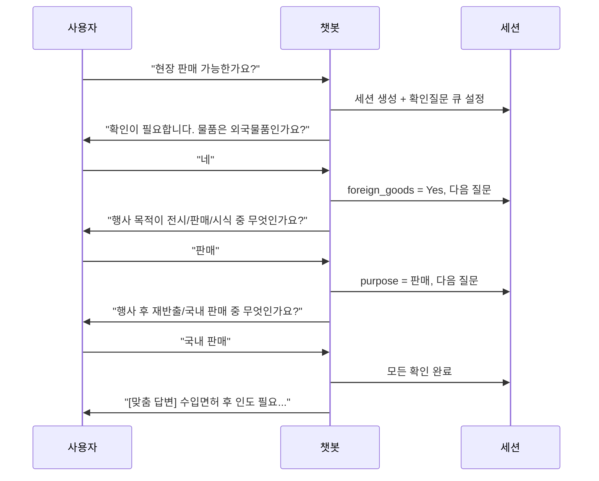
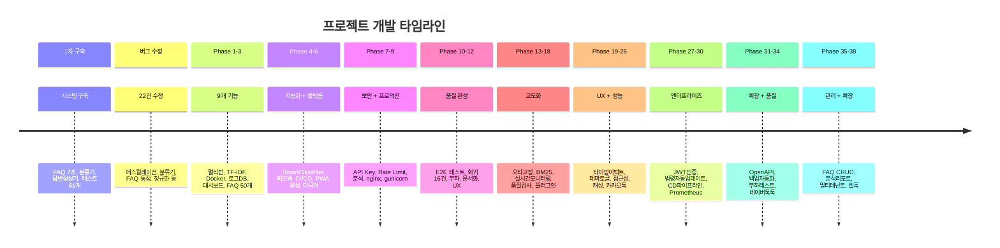

# 보세전시장 민원응대 챗봇

법제처 국가법령정보센터의 현행 법령과 관세청 공식 자료를 기반으로 한 보세전시장 민원응대 챗봇 시스템입니다.

---

## 주요 수치

| 항목 | 수치 |
|------|------|
| FAQ | 50개 (v3.0.0) |
| 질문 카테고리 | 10개 |
| 에스컬레이션 규칙 | 5개 |
| 테스트 | 895개 (전체 PASS) |
| 소스 코드 | 10,238줄 (src/ + web_server + simulator) |
| 테스트 코드 | 9,408줄 |
| 소스 파일 | 43개 |
| 테스트 파일 | 37개 |
| 커밋 | 37개 |

---

## 핵심 기능

| 기능 | 설명 |
|------|------|
| 하이브리드 매칭 | 키워드 스코어 → TF-IDF → BM25 폴백 3단계 매칭 |
| 한국어 NLP | 형태소 토크나이저 + 동의어 사전(30개) + 오타 교정(자모 분해) |
| 멀티턴 대화 | 세션 기반 확인 질문, 30분 만료, 맥락 인식 분류 |
| 모호 질문 처리 | 되묻기 엔진으로 1~2개 카테고리 추려서 명확화 |
| 관련 질문 추천 | 답변 시 관련 FAQ 자동 추천 |
| 에스컬레이션 | 5개 규칙 기반 전문 담당자 연결 |
| 다국어 지원 | KO/EN/CN/JP 자동 감지 및 구조 레이블 번역 |
| PWA + 음성 | 오프라인 캐싱, Web Speech API 음성 입력 |
| 보안 | API Key 인증, IP Rate Limiting, 입력 살균 |
| 실시간 모니터링 | 이벤트 추적, 알림 임계값, 피크 분석 |
| FAQ 품질 검사 | 키워드 중복, 커버리지, 답변 완성도 자동 진단 |
| 플러그인 시스템 | pre/post 훅 6개 지점으로 확장 가능 |
| 대화 내보내기 | Text/JSON/CSV/HTML 4종 포맷 |
| 법령 업데이트 | 법제처 API 연동, 변경 감지, FAQ 영향 분석, 알림 |
| 만족도 추적 | 자동 만족도 트렌드 분석 및 낮은 답변 감지 |
| JWT 인증 | 관리자 로그인, 토큰 발급/검증, 역할 기반 접근 제어 |
| 카카오톡 연동 | 오픈빌더 스킬 서버, 캐러셀 카드, 빠른 응답 |
| CD 파이프라인 | GitHub Actions, 블루/그린 배포, 자동 롤백 |
| Prometheus | 요청 카운터, 히스토그램, 게이지 + Grafana 대시보드 |
| Slack 알림 | 장애 알림, 일일 보고서, 웹훅 재시도 |
| OpenAPI/Swagger | 35개 엔드포인트 문서화, Swagger UI |
| 백업 자동화 | 증분 백업, 암호화, 복원 검증, 스케줄 |
| 부하 테스트 | 6개 시나리오, 벤치마크, 성능 리포트 |
| 네이버 톡톡 | 웹훅 어댑터, 캐러셀 카드, 복합 메시지 |
| FAQ 관리 UI | 웹 CRUD, 실시간 미리보기, 버전 히스토리 |
| 분석 리포트 | 일간/주간/월간 자동생성, HTML 리포트 |
| 멀티 테넌트 | 복수 보세전시장 지원, 테넌트별 FAQ/설정 분리 |
| 웹훅 시스템 | 이벤트 발송, HMAC 서명, 구독 관리, 배송 로그 |

---

## 시스템 아키텍처



## 질문 처리 흐름도



## 카테고리별 FAQ 분포 (50개)



## 에스컬레이션 분기도



## 멀티턴 대화 흐름



---

## 빠른 시작

### 설치 (2분)

```bash
git clone https://github.com/sun475300-sudo/bonded-exhibition-chatbot-data.git
cd bonded-exhibition-chatbot-data
pip install -r requirements.txt
```

### 실행

```bash
# 웹 챗봇 (브라우저에서 http://127.0.0.1:8080)
python web_server.py --port 8080

# 관리자 대시보드 (http://127.0.0.1:8080/admin)

# 터미널 시뮬레이터
python simulator.py              # 대화형
python simulator.py --test       # 자동 테스트
python simulator.py -q "질문"    # 단일 질문

# Docker 배포
docker-compose up -d
```

### 테스트
```bash
python -m pytest tests/ -v       # 895개 테스트 전체 PASS

# 특정 모듈만
python -m pytest tests/test_chatbot.py -v
python -m pytest tests/test_e2e.py -v         # E2E + 회귀 + 부하
python -m pytest tests/test_phase13_18.py -v  # 오타교정, BM25, 모니터링 등
python -m pytest tests/test_auth.py -v        # JWT 인증
python -m pytest tests/test_kakao.py -v       # 카카오톡 연동
python -m pytest tests/test_metrics.py -v     # Prometheus 메트릭
```

---

## 프로젝트 구조

```
bonded-exhibition-chatbot-data/
├── config/
│   ├── system_prompt.txt          # 시스템 프롬프트
│   └── chatbot_config.json        # 설정 (페르소나, 카테고리, 연락처)
├── data/
│   ├── faq.json                   # FAQ 50개 (v3.0.0)
│   ├── legal_references.json      # 법령 근거 8건
│   └── escalation_rules.json      # 에스컬레이션 5규칙
├── templates/
│   └── response_template.json     # 답변 포맷
├── src/
│   ├── chatbot.py                 # 메인 로직 (키워드+TF-IDF 하이브리드)
│   ├── classifier.py              # 분류기 (10카테고리, 도메인 우선순위)
│   ├── similarity.py              # TF-IDF 유사도 매칭 (순수 Python)
│   ├── smart_classifier.py        # 스마트 분류기 (대화 맥락 인식)
│   ├── session.py                 # 멀티턴 세션 관리 (30분 만료)
│   ├── response_builder.py        # 답변 생성기 (면책 단일 관리)
│   ├── escalation.py              # 에스컬레이션 (캐싱, normalize)
│   ├── validator.py               # 확인 질문 (중복 방지)
│   ├── logger_db.py               # SQLite 질문 로그
│   ├── feedback.py                # 피드백 관리 (helpful/unhelpful)
│   ├── security.py                # API Key 인증 + Rate Limiter
│   ├── analytics.py               # 트렌드 분석 + 품질 점수
│   ├── auto_faq_pipeline.py       # FAQ 자동 추천 파이프라인
│   ├── faq_recommender.py         # 미매칭 클러스터링 → FAQ 후보
│   ├── translator.py              # 다국어 (KO/EN/CN/JP)
│   ├── config_manager.py          # 환경변수 → 설정 관리
│   ├── data_validator.py          # 데이터 정합성 검증
│   ├── kakao_adapter.py           # 카카오톡 어댑터
│   ├── llm_fallback.py            # LLM 하이브리드 폴백
│   ├── law_updater.py             # 법령 업데이트 감지
│   ├── synonym_resolver.py        # 동의어 사전 (30개 매핑)
│   ├── spell_corrector.py         # 오타 교정 (레벤슈타인 거리)
│   ├── clarification.py           # 모호 질문 되묻기 엔진
│   ├── satisfaction_tracker.py    # 답변 만족도 자동 추적
│   ├── korean_tokenizer.py        # 한국어 형태소 토크나이저
│   ├── bm25_ranker.py             # BM25 랭킹 엔진
│   ├── related_faq.py             # 관련 질문 추천
│   ├── realtime_monitor.py        # 실시간 모니터링
│   ├── faq_quality_checker.py     # FAQ 품질 자동 검사
│   ├── conversation_export.py     # 대화 내보내기 (Text/JSON/CSV/HTML)
│   ├── plugin_system.py           # 플러그인 시스템 (6개 훅)
│   ├── auth.py                    # JWT 인증 (HS256, 순수 Python)
│   ├── metrics.py                 # Prometheus 메트릭 수집기
│   ├── slack_notifier.py          # Slack 알림 (웹훅, 재시도)
│   ├── backup_manager.py          # 백업/복구 (증분, 암호화, 스케줄)
│   ├── naver_adapter.py           # 네이버 톡톡 어댑터
│   ├── faq_manager.py             # FAQ CRUD + 버전 히스토리
│   ├── report_generator.py        # 분석 리포트 (일간/주간/월간)
│   ├── tenant_manager.py          # 멀티 테넌트 관리
│   ├── webhook_manager.py         # 이벤트 웹훅 시스템
│   └── utils.py                   # 유틸리티
├── tests/                         # 895개 테스트
│   ├── test_chatbot.py            # 통합 테스트
│   ├── test_classifier.py         # 분류기
│   ├── test_similarity.py         # TF-IDF 매칭
│   ├── test_smart_classifier.py   # 스마트 분류기
│   ├── test_session.py            # 멀티턴 세션
│   ├── test_response_builder.py   # 답변 생성기
│   ├── test_escalation.py         # 에스컬레이션
│   ├── test_validator.py          # 확인 질문
│   ├── test_logger_db.py          # 로그 DB
│   ├── test_feedback.py           # 피드백
│   ├── test_security.py           # 보안
│   ├── test_analytics.py          # 분석
│   ├── test_auto_faq_pipeline.py  # FAQ 파이프라인
│   ├── test_faq_recommender.py    # FAQ 추천
│   ├── test_translator.py         # 다국어
│   ├── test_config_manager.py     # 설정 관리
│   ├── test_data_validator.py     # 데이터 정합성
│   ├── test_edge_cases.py         # 에지케이스
│   ├── test_e2e.py                # E2E + 회귀 + 부하
│   ├── test_phase13_18.py         # Phase 13-18 기능 테스트
│   ├── test_phase19_25.py         # Phase 19-25 통합 테스트
│   ├── test_kakao.py              # 카카오톡 연동 테스트
│   ├── test_auth.py               # JWT 인증 테스트
│   ├── test_metrics.py            # Prometheus 메트릭 테스트
│   ├── test_slack_notifier.py     # Slack 알림 테스트
│   ├── test_law_updater.py        # 법령 업데이트 테스트
│   ├── test_backup_manager.py     # 백업 매니저 테스트
│   ├── test_naver_adapter.py      # 네이버 톡톡 테스트
│   ├── test_openapi.py            # OpenAPI 스펙 테스트
│   ├── test_benchmark.py          # 벤치마크 테스트
│   ├── test_faq_manager.py        # FAQ 관리 테스트
│   ├── test_report_generator.py   # 리포트 생성 테스트
│   ├── test_tenant_manager.py     # 멀티 테넌트 테스트
│   ├── test_webhook_manager.py    # 웹훅 테스트
│   └── test_web_api.py            # 웹 API
├── web/
│   ├── index.html                 # 챗봇 UI (다크/라이트 테마, PWA, 음성, 접근성)
│   ├── admin.html                 # 관리자 대시보드 (JWT 인증)
│   ├── login.html                 # 관리자 로그인 페이지
│   ├── swagger.html               # Swagger UI (API 문서)
│   ├── faq-manager.html           # FAQ 관리 UI (CRUD)
│   ├── manifest.json              # PWA 매니페스트
│   ├── sw.js                      # 서비스 워커 (오프라인 캐싱)
│   ├── icon-192.svg               # PWA 아이콘 (192x192)
│   └── icon-512.svg               # PWA 아이콘 (512x512)
├── docs/
│   ├── openapi.yaml               # OpenAPI 3.0 스펙 (35개 엔드포인트)
│   ├── API.md                     # API 레퍼런스
│   ├── OPERATIONS.md              # 운영 매뉴얼
│   └── DEVELOPER.md               # 개발자 가이드
├── deploy/
│   ├── nginx.conf                 # nginx 리버스 프록시
│   ├── gunicorn_config.py         # gunicorn 설정
│   ├── backup.sh                  # 백업 스크립트
│   ├── restore.sh                 # 복원 스크립트
│   ├── healthcheck.py             # 헬스체크 (상세 진단)
│   ├── blue_green.sh              # 블루/그린 배포
│   ├── rollback.sh                # 롤백 스크립트
│   ├── docker-build.sh            # Docker 빌드 + 태깅
│   └── grafana_dashboard.json     # Grafana 대시보드 JSON
├── .github/workflows/
│   ├── ci.yml                     # CI 파이프라인 (테스트)
│   └── cd.yml                     # CD 파이프라인 (배포)
├── web_server.py                  # Flask 서버 (보안, 로깅, CORS)
├── simulator.py                   # 터미널 시뮬레이터
├── Dockerfile                     # Docker 이미지
├── docker-compose.yml             # Docker Compose
├── CHANGELOG.md                   # 변경 이력
└── requirements.txt               # flask, flask-cors, pytest
```

## 사이트 적용 가이드

### A. iframe 삽입
```html
<iframe src="http://챗봇서버:8080" width="400" height="600"
        style="border:none;border-radius:12px;box-shadow:0 4px 24px rgba(0,0,0,0.15);"></iframe>
```

### B. 팝업 위젯 (복붙)
```html
<div id="chatbot-widget" style="position:fixed;bottom:24px;right:24px;z-index:9999;">
  <iframe id="chatbot-frame" src="http://챗봇서버:8080"
    style="display:none;width:400px;height:600px;border:none;border-radius:12px;
           box-shadow:0 8px 32px rgba(0,0,0,0.3);"></iframe>
  <button onclick="var f=document.getElementById('chatbot-frame');
    f.style.display=f.style.display==='none'?'block':'none';"
    style="width:60px;height:60px;border-radius:50%;border:none;
           background:linear-gradient(135deg,#1565C0,#1E88E5);color:#fff;
           font-size:24px;cursor:pointer;box-shadow:0 4px 16px rgba(21,101,192,0.4);">B</button>
</div>
```

### C. REST API

| 엔드포인트 | 메서드 | 설명 |
|-----------|--------|------|
| `/api/chat` | POST | 질문 처리 `{"query":"...", "session_id":"optional"}` |
| `/api/session/new` | POST | 세션 생성 |
| `/api/session/<id>` | GET | 세션 상태 |
| `/api/faq` | GET | FAQ 50개 목록 |
| `/api/autocomplete` | GET | 자동완성 `?q=검색어` (최대 5개) |
| `/api/export` | POST | 대화 내보내기 (text/json/csv/html) |
| `/api/config` | GET | 설정 정보 |
| `/api/health` | GET | 서버 상태 |
| `/api/auth/login` | POST | 관리자 로그인 (JWT 토큰 발급) |
| `/api/auth/me` | GET | 현재 사용자 정보 |
| `/api/kakao/chat` | POST | 카카오톡 스킬 서버 |
| `/api/kakao/faq` | POST | 카카오톡 FAQ 캐러셀 |
| `/metrics` | GET | Prometheus 메트릭 |
| `/api/admin/stats` | GET | 통계 (JWT 필요) |
| `/api/admin/logs` | GET | 최근 로그 (JWT 필요) |
| `/api/admin/unmatched` | GET | 미매칭 질문 (JWT 필요) |
| `/api/admin/realtime` | GET | 실시간 모니터링 (JWT 필요) |
| `/api/admin/faq-quality` | GET | FAQ 품질 보고서 (JWT 필요) |
| `/api/admin/satisfaction` | GET | 만족도 트렌드 (JWT 필요) |
| `/api/admin/law-updates` | GET | 법령 변경 알림 (JWT 필요) |
| `/api/admin/cache/clear` | POST | 캐시 무효화 (JWT 필요) |

### D. Docker 배포
```bash
docker-compose up -d
# http://서버IP:8080 (챗봇)
# http://서버IP:8080/admin (관리자)
```

---

## 핵심 법적 근거

| 법령 | 조문 | 내용 |
|------|------|------|
| 관세법 | 제190조 | 보세전시장 정의 |
| 관세법 | 제161조 | 견본품 반출 (세관장 허가) |
| 관세법 | 제269조 | 밀수출입죄 |
| 관세법 | 제183조 | 보세창고 |
| 관세법 시행령 | 제101조 | 판매용품의 면허전 사용금지 |
| 관세법 시행령 | 제102조 | 직매된 전시용품의 통관전 반출금지 |
| 관세법 | 제226조 | 세관장확인 |
| 관세청 고시 | 제2026-15호 | 보세전시장 운영에 관한 고시 |

## 개발 타임라인



## 업데이트 내역

| 버전 | 주요 내용 |
|------|------|
| v1.0.0 | 챗봇 구축 (FAQ 7개, 분류기, 답변생성기, 에스컬레이션) |
| v1.x | 버그 22건 수정 (분류기, FAQ 매칭, 정규화 등) |
| v2.0.0 | Phase 1-6 (멀티턴, TF-IDF, Docker, SmartClassifier, PWA, 다국어) |
| v3.0.0 | Phase 7-12 (보안, 분석, 프로덕션, E2E 테스트, 문서화, UX) |
| v4.0.0 | Phase 13-18 (오타교정, BM25, 실시간모니터링, 품질검사, 플러그인) |
| v5.0.0 | Phase 19-26 (타이핑이펙트, 테마토글, 접근성, 성능최적화, 카카오톡, 통합테스트) |
| v6.0.0 | Phase 27-30 (JWT 인증, 법령 자동 업데이트, CD 파이프라인, Prometheus, Slack 알림) |
| v7.0.0 | Phase 31-34 (OpenAPI/Swagger, 백업 자동화, 부하 테스트/벤치마크, 네이버 톡톡) |
| v8.0.0 | Phase 35-38 (FAQ 관리 UI, 분석 리포트, 멀티 테넌트, 웹훅 시스템) |

## 기술 스택

| 분야 | 기술 |
|------|------|
| Backend | Python 3.11, Flask, gunicorn |
| Frontend | HTML5, CSS3, JavaScript (Vanilla) |
| NLP | TF-IDF, BM25, 레벤슈타인 거리, 자모 분해 (순수 Python) |
| DB | SQLite (로그, 피드백, FAQ 파이프라인) |
| 인증 | JWT (HS256, 순수 Python hmac+hashlib) |
| 배포 | Docker, docker-compose, nginx, 블루/그린 배포 |
| CI/CD | GitHub Actions (CI + CD 파이프라인) |
| 모니터링 | Prometheus 메트릭, Grafana 대시보드, Slack 알림 |
| PWA | Service Worker, Web App Manifest |
| 테스트 | pytest (단위/통합/E2E/회귀/부하) |

---

## 라이선스

이 프로젝트의 법령 데이터는 법제처 국가법령정보센터 및 관세청 공식 자료를 참고하였습니다.
