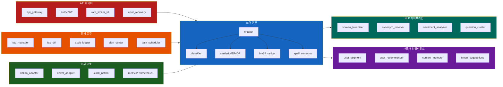
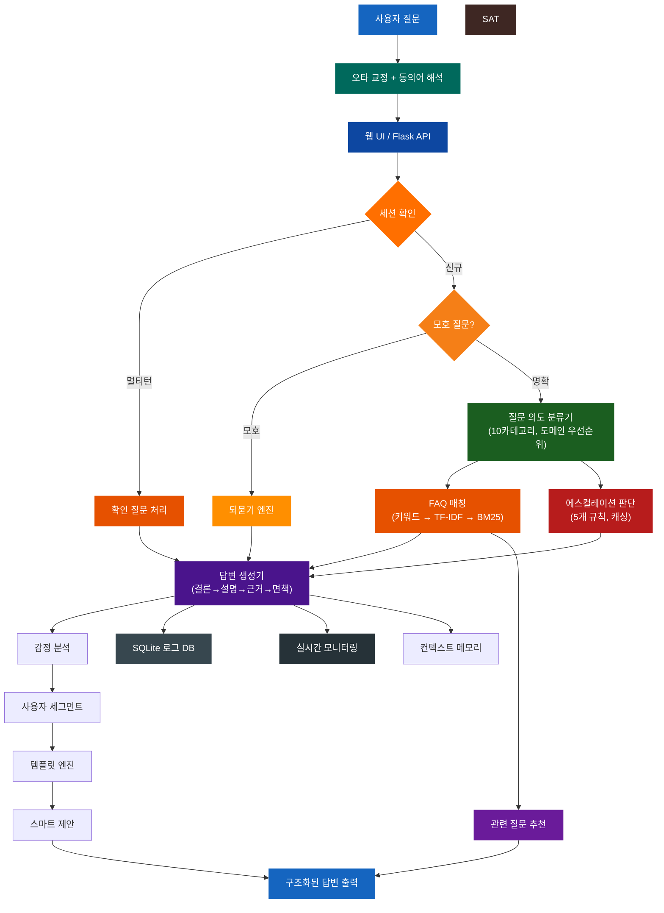
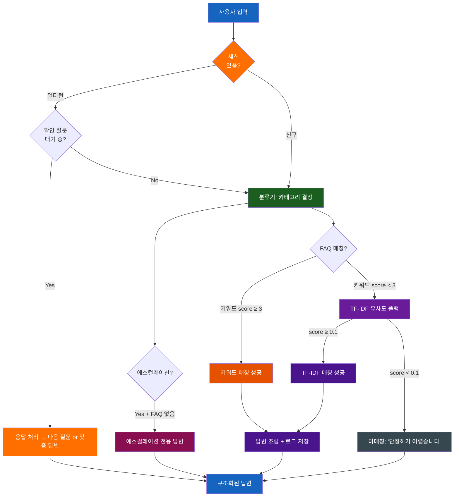
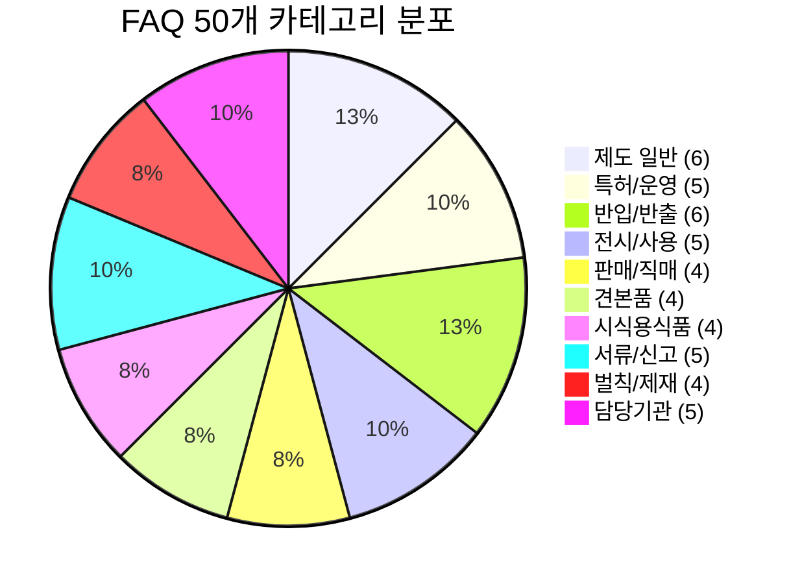
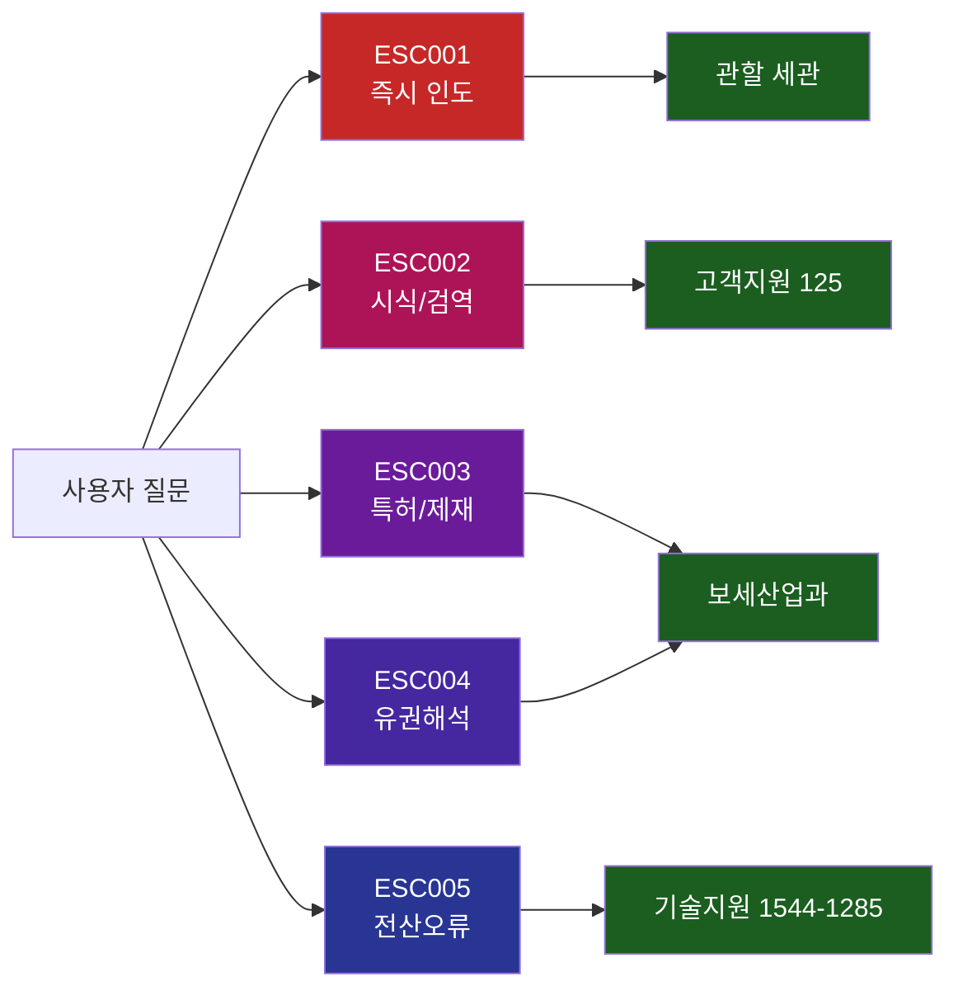
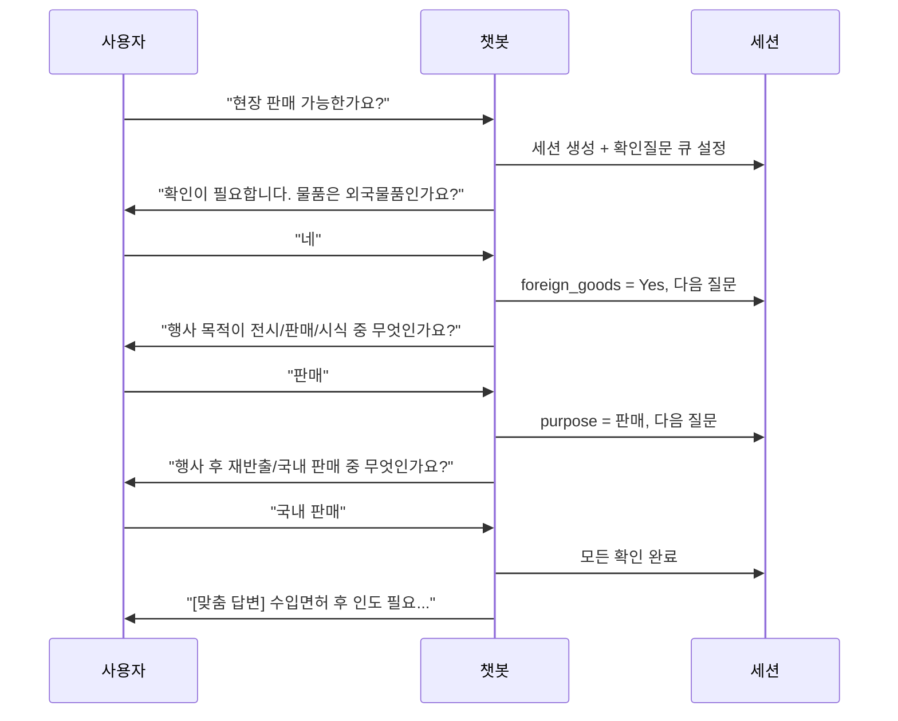
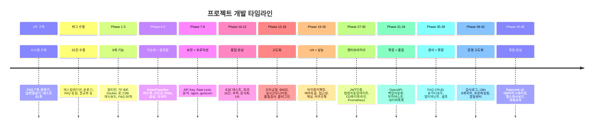

# 보세전시장 민원응대 챗봇

법제처 국가법령정보센터의 현행 법령과 관세청 공식 자료를 기반으로 한 보세전시장 민원응대 챗봇 시스템입니다.

---

## 주요 수치

| 항목 | 수치 |
|------|------|
| FAQ | 50개 (v4.0.0 Premium) |
| 질문 카테고리 | 10개 |
| 에스컬레이션 규칙 | 5개 |
| 테스트 | 2,081개 (전체 PASS) |
| 소스 코드 | 21,605줄 (src/ + web_server + simulator) |
| 테스트 코드 | 21,197줄 |
| 소스 파일 | 70개 |
| 테스트 파일 | 70개 |
| 커밋 | 70개 |

---

## 핵심 기능

| 기능 | 설명 |
|------|------|
| 하이브리드 매칭 | 키워드 스코어 → TF-IDF → BM25 폴백 3단계 매칭 |
| 한국어 NLP | 형태소 토크나이저 + 동의어 사전(30개) + 오타 교정(자모 분해) |
| 멀티턴 대화 | 세션 기반 확인 질문, 30분 만료, 맥락 인식 분류 |
| 모호 질문 처리 | 되묻기 엔진으로 1~2개 카테고리 추려서 명확화 |
| 관련 질문 추천 | 답변 시 관련 FAQ 자동 추천 |
| 에스컬레이션 | 5개 규칙 기반 전문 담당자 연결 |
| 다국어 지원 | KO/EN/CN/JP 자동 감지 및 구조 레이블 번역 |
| PWA + 음성 | 오프라인 캐싱, Web Speech API 음성 입력 |
| 보안 | API Key 인증, IP Rate Limiting, 입력 살균 |
| 실시간 모니터링 | 이벤트 추적, 알림 임계값, 피크 분석 |
| FAQ 품질 검사 | 키워드 중복, 커버리지, 답변 완성도 자동 진단 |
| 플러그인 시스템 | pre/post 훅 6개 지점으로 확장 가능 |
| 대화 내보내기 | Text/JSON/CSV/HTML 4종 포맷 |
| 법령 업데이트 | 법제처 API 연동, 변경 감지, FAQ 영향 분석, 알림 |
| 만족도 추적 | 자동 만족도 트렌드 분석 및 낮은 답변 감지 |
| JWT 인증 | 관리자 로그인, 토큰 발급/검증, 역할 기반 접근 제어 |
| 카카오톡 연동 | 오픈빌더 스킬 서버, 캐러셀 카드, 빠른 응답 |
| CD 파이프라인 | GitHub Actions, 블루/그린 배포, 자동 롤백 |
| Prometheus | 요청 카운터, 히스토그램, 게이지 + Grafana 대시보드 |
| Slack 알림 | 장애 알림, 일일 보고서, 웹훅 재시도 |
| OpenAPI/Swagger | 35개 엔드포인트 문서화, Swagger UI |
| 백업 자동화 | 증분 백업, 암호화, 복원 검증, 스케줄 |
| 부하 테스트 | 6개 시나리오, 벤치마크, 성능 리포트 |
| 네이버 톡톡 | 웹훅 어댑터, 캐러셀 카드, 복합 메시지 |
| FAQ 관리 UI | 웹 CRUD, 실시간 미리보기, 버전 히스토리 |
| 분석 리포트 | 일간/주간/월간 자동생성, HTML 리포트 |
| 멀티 테넌트 | 복수 보세전시장 지원, 테넌트별 FAQ/설정 분리 |
| 웹훅 시스템 | 이벤트 발송, HMAC 서명, 구독 관리, 배송 로그 |
| 감사 로그 | 관리자 행위 추적, 변경 이력, 감사 통계 |
| i18n 6개국어 | KO/EN/CN/JP/VI/TH 번역 파일, 자동 언어 감지 |
| 성능 프로파일링 | cProfile 통합, 컴포넌트 벤치마크, 병목 감지 |
| 알림 센터 | 임계값 기반 규칙 엔진, 인앱 알림, 자동 감지 |
| 지식 그래프 | FAQ 관계 매핑, BFS 경로 탐색, 그래프 시각화 |
| 사용자 세그먼트 | 초보/중급/전문가 분류, 답변 깊이 자동 조절 |
| 컨텍스트 메모리 | 장기 대화 기억, 이전 세션 참조, 사용자 프로필 |
| 응답 템플릿 엔진 | 동적 템플릿, 조건부/루프, 도메인 독립 커스텀 |
| 도메인 설정 | 멀티 도메인 지원, 템플릿, 검증, 스위칭 |
| API 게이트웨이 | v1/v2 버전관리, 페이지네이션, 정렬, 디프리케이션 |
| 대화 분석 v2 | 패턴 감지, 이탈률, 해결률, 자동 인사이트 |
| 응답 품질 스코어러 | 5차원 0-100점, 개선 제안, 카테고리별 품질 |
| FAQ 버전 관리 | 스냅샷, 필드별 diff, 원클릭 롤백 |
| 스마트 제안 | 후속 질문 자동 추천, 온보딩, 맥락 팁 |
| 오류 복구 | 재시도, 서킷 브레이커, 폴백, 에러 통계 |

---

## 시스템 구성요소



---

## 시스템 아키텍처



## 질문 처리 흐름도



## 카테고리별 FAQ 분포 (50개)



## 에스컬레이션 분기도



## 멀티턴 대화 흐름



---

## 빠른 시작 — 60초 안에

| 환경            | 1-라인 실행                              | 추천 대상            |
|-----------------|------------------------------------------|----------------------|
| 🐳 Docker       | `docker compose up -d`                   | 모든 플랫폼 (권장)   |
| 🐧 Linux/Mac    | `./start.sh`                             | 로컬 개발 (Unix)     |
| 🪟 Windows .bat | `start_chatbot_simple.bat`               | 윈도우 더블클릭 실행 |
| 🐧 WSL          | `./start.sh` (Ubuntu/WSL)                | 윈도우 + Unix 도구   |

### 1단계 — 클론 + 환경변수

```bash
git clone https://github.com/sun475300-sudo/bonded-exhibition-chatbot-data.git
cd bonded-exhibition-chatbot-data
cp .env.example .env       # 필수 변수만 채우면 됨 (.env 안내 주석 참고)
```

### 2단계 — 실행 (4가지 중 택1)

#### A. Docker (권장 — 모든 플랫폼 동일)

```bash
docker compose up -d                   # 백그라운드 실행
docker compose logs -f                 # 로그 따라가기
docker compose down                    # 종료
```
→ <http://127.0.0.1:8080> 접속.
풀스택(nginx + redis 포함): `docker compose -f docker-compose.production.yml up -d`

#### B. Linux/Mac (venv 자동 + 의존성 자동 설치)

```bash
./start.sh                             # 8080 포트
./start.sh --port 5000                 # 다른 포트
```

#### C. Windows (.bat 더블클릭)

```bat
start_chatbot_simple.bat
```
또는 PowerShell:
```powershell
py -m venv .venv
.\.venv\Scripts\Activate.ps1
pip install -r requirements.txt
py web_server.py --port 8080
```

#### D. WSL (Ubuntu on Windows)

```bash
# Ubuntu 셸에서
sudo apt install -y python3-venv
./start.sh
# 브라우저에서 http://127.0.0.1:8080 (Windows Chrome도 자동 연결)
```

### Make 명령 (단축키)

```bash
make install        # pip install -r requirements.txt
make run            # python web_server.py
make test           # pytest 전체
make docker-up      # docker compose up -d + 헬스체크 대기
make docker-down    # 종료
make help           # 전체 명령 목록
```

### Troubleshooting

| 증상                              | 원인 / 해결                                                              |
|-----------------------------------|--------------------------------------------------------------------------|
| `port 8080 already in use`        | `CHATBOT_PORT=9000 docker compose up -d` 또는 `./start.sh --port 9000`   |
| `JWT_SECRET_KEY` 경고             | `.env` 의 기본값을 `python -c "import secrets;print(secrets.token_urlsafe(64))"` 결과로 교체 |
| `ModuleNotFoundError: flask`      | venv 활성화 안됨 → `source .venv/bin/activate` (Linux/Mac) / `.venv\Scripts\Activate.ps1` (Win) |
| Docker 빌드 시 sentence-transformers 다운로드 느림 | 정상 (~200MB). hf-cache 볼륨에 1회 캐시 후 재시작은 빠름. |
| `.env` 적용 안됨                  | Docker는 자동 로드. start.sh 도 자동 로드. 직접 실행 시 `set -a; source .env; set +a` |
| `permission denied: ./start.sh`   | `chmod +x start.sh`                                                       |
| Windows에서 `make` 없다고 함      | Git Bash 사용 또는 `choco install make` / `scoop install make`           |

### 추가 실행 모드

```bash
# 관리자 대시보드: http://127.0.0.1:8080/admin
# Swagger:        http://127.0.0.1:8080/swagger
# 헬스체크:       http://127.0.0.1:8080/api/health

# 터미널 시뮬레이터
python simulator.py              # 대화형
python simulator.py --test       # 자동 테스트
python simulator.py -q "질문"    # 단일 질문
```

### 테스트
```bash
python -m pytest tests/ -v       # 2,081개 테스트 전체 PASS

# 특정 모듈만
python -m pytest tests/test_chatbot.py -v
python -m pytest tests/test_e2e.py -v         # E2E + 회귀 + 부하
python -m pytest tests/test_phase13_18.py -v  # 오타교정, BM25, 모니터링 등
python -m pytest tests/test_auth.py -v        # JWT 인증
python -m pytest tests/test_kakao.py -v       # 카카오톡 연동
python -m pytest tests/test_metrics.py -v     # Prometheus 메트릭
```

---

## 프로젝트 구조

```
bonded-exhibition-chatbot-data/
├── config/
│   ├── system_prompt.txt          # 시스템 프롬프트
│   └── chatbot_config.json        # 설정 (페르소나, 카테고리, 연락처)
├── data/
│   ├── faq.json                   # FAQ 50개 (v3.0.0)
│   ├── legal_references.json      # 법령 근거 8건
│   └── escalation_rules.json      # 에스컬레이션 5규칙
├── templates/
│   └── response_template.json     # 답변 포맷
├── src/
│   ├── chatbot.py                 # 메인 로직 (키워드+TF-IDF 하이브리드)
│   ├── classifier.py              # 분류기 (10카테고리, 도메인 우선순위)
│   ├── similarity.py              # TF-IDF 유사도 매칭 (순수 Python)
│   ├── smart_classifier.py        # 스마트 분류기 (대화 맥락 인식)
│   ├── session.py                 # 멀티턴 세션 관리 (30분 만료)
│   ├── response_builder.py        # 답변 생성기 (면책 단일 관리)
│   ├── escalation.py              # 에스컬레이션 (캐싱, normalize)
│   ├── validator.py               # 확인 질문 (중복 방지)
│   ├── logger_db.py               # SQLite 질문 로그
│   ├── feedback.py                # 피드백 관리 (helpful/unhelpful)
│   ├── security.py                # API Key 인증 + Rate Limiter
│   ├── analytics.py               # 트렌드 분석 + 품질 점수
│   ├── auto_faq_pipeline.py       # FAQ 자동 추천 파이프라인
│   ├── faq_recommender.py         # 미매칭 클러스터링 → FAQ 후보
│   ├── translator.py              # 다국어 (KO/EN/CN/JP)
│   ├── config_manager.py          # 환경변수 → 설정 관리
│   ├── data_validator.py          # 데이터 정합성 검증
│   ├── kakao_adapter.py           # 카카오톡 어댑터
│   ├── llm_fallback.py            # LLM 하이브리드 폴백
│   ├── law_updater.py             # 법령 업데이트 감지
│   ├── synonym_resolver.py        # 동의어 사전 (30개 매핑)
│   ├── spell_corrector.py         # 오타 교정 (레벤슈타인 거리)
│   ├── clarification.py           # 모호 질문 되묻기 엔진
│   ├── satisfaction_tracker.py    # 답변 만족도 자동 추적
│   ├── korean_tokenizer.py        # 한국어 형태소 토크나이저
│   ├── bm25_ranker.py             # BM25 랭킹 엔진
│   ├── related_faq.py             # 관련 질문 추천
│   ├── realtime_monitor.py        # 실시간 모니터링
│   ├── faq_quality_checker.py     # FAQ 품질 자동 검사
│   ├── conversation_export.py     # 대화 내보내기 (Text/JSON/CSV/HTML)
│   ├── plugin_system.py           # 플러그인 시스템 (6개 훅)
│   ├── auth.py                    # JWT 인증 (HS256, 순수 Python)
│   ├── metrics.py                 # Prometheus 메트릭 수집기
│   ├── slack_notifier.py          # Slack 알림 (웹훅, 재시도)
│   ├── backup_manager.py          # 백업/복구 (증분, 암호화, 스케줄)
│   ├── naver_adapter.py           # 네이버 톡톡 어댑터
│   ├── faq_manager.py             # FAQ CRUD + 버전 히스토리
│   ├── report_generator.py        # 분석 리포트 (일간/주간/월간)
│   ├── tenant_manager.py          # 멀티 테넌트 관리
│   ├── webhook_manager.py         # 이벤트 웹훅 시스템
│   ├── audit_logger.py            # 감사 로그 (관리자 행위 추적)
│   ├── i18n.py                    # 국제화 (6개 언어, 번역 파일)
│   ├── profiler.py                # 성능 프로파일링 (cProfile)
│   ├── alert_center.py            # 알림 센터 (규칙 엔진, 임계값)
│   ├── knowledge_graph.py         # 지식 그래프 (BFS, 관계 매핑)
│   ├── user_segment.py            # 사용자 세그먼트 (초보/중급/전문가)
│   ├── context_memory.py          # 컨텍스트 메모리 (장기 대화 기억)
│   ├── template_engine.py         # 동적 응답 템플릿 엔진
│   ├── chart_data.py              # 차트 데이터 (Chart.js 호환)
│   ├── domain_config.py           # 도메인 설정 (멀티 도메인)
│   ├── sentiment_analyzer.py      # 감정 분석 (한국어 사전)
│   ├── question_cluster.py        # 질문 클러스터링 (중복 탐지)
│   ├── flow_analyzer.py           # 대화 흐름 분석 (Sankey)
│   ├── task_scheduler.py          # 스케줄러 (cron 파서)
│   ├── api_gateway.py             # API 게이트웨이 (버전관리)
│   ├── conversation_analytics.py  # 대화 분석 v2 (패턴, 인사이트)
│   ├── quality_scorer.py          # 응답 품질 스코어러 (0-100)
│   ├── faq_diff.py                # FAQ 버전 비교/롤백
│   ├── smart_suggestions.py       # 스마트 제안 (후속 질문)
│   ├── error_recovery.py          # 오류 복구 (서킷 브레이커)
│   └── utils.py                   # 유틸리티
├── tests/                         # 2,081개 테스트
│   ├── test_chatbot.py            # 통합 테스트
│   ├── test_classifier.py         # 분류기
│   ├── test_similarity.py         # TF-IDF 매칭
│   ├── test_smart_classifier.py   # 스마트 분류기
│   ├── test_session.py            # 멀티턴 세션
│   ├── test_response_builder.py   # 답변 생성기
│   ├── test_escalation.py         # 에스컬레이션
│   ├── test_validator.py          # 확인 질문
│   ├── test_logger_db.py          # 로그 DB
│   ├── test_feedback.py           # 피드백
│   ├── test_security.py           # 보안
│   ├── test_analytics.py          # 분석
│   ├── test_auto_faq_pipeline.py  # FAQ 파이프라인
│   ├── test_faq_recommender.py    # FAQ 추천
│   ├── test_translator.py         # 다국어
│   ├── test_config_manager.py     # 설정 관리
│   ├── test_data_validator.py     # 데이터 정합성
│   ├── test_edge_cases.py         # 에지케이스
│   ├── test_e2e.py                # E2E + 회귀 + 부하
│   ├── test_phase13_18.py         # Phase 13-18 기능 테스트
│   ├── test_phase19_25.py         # Phase 19-25 통합 테스트
│   ├── test_kakao.py              # 카카오톡 연동 테스트
│   ├── test_auth.py               # JWT 인증 테스트
│   ├── test_metrics.py            # Prometheus 메트릭 테스트
│   ├── test_slack_notifier.py     # Slack 알림 테스트
│   ├── test_law_updater.py        # 법령 업데이트 테스트
│   ├── test_backup_manager.py     # 백업 매니저 테스트
│   ├── test_naver_adapter.py      # 네이버 톡톡 테스트
│   ├── test_openapi.py            # OpenAPI 스펙 테스트
│   ├── test_benchmark.py          # 벤치마크 테스트
│   ├── test_faq_manager.py        # FAQ 관리 테스트
│   ├── test_report_generator.py   # 리포트 생성 테스트
│   ├── test_tenant_manager.py     # 멀티 테넌트 테스트
│   ├── test_webhook_manager.py    # 웹훅 테스트
│   ├── test_audit_logger.py       # 감사 로그 테스트
│   ├── test_i18n.py               # 국제화 테스트
│   ├── test_profiler.py           # 프로파일러 테스트
│   ├── test_alert_center.py       # 알림 센터 테스트
│   └── test_web_api.py            # 웹 API
├── web/
│   ├── index.html                 # 챗봇 UI (다크/라이트 테마, PWA, 음성, 접근성)
│   ├── admin.html                 # 관리자 대시보드 (JWT 인증)
│   ├── login.html                 # 관리자 로그인 페이지
│   ├── swagger.html               # Swagger UI (API 문서)
│   ├── faq-manager.html           # FAQ 관리 UI (CRUD)
│   ├── manifest.json              # PWA 매니페스트
│   ├── sw.js                      # 서비스 워커 (오프라인 캐싱)
│   ├── icon-192.svg               # PWA 아이콘 (192x192)
│   └── icon-512.svg               # PWA 아이콘 (512x512)
├── docs/
│   ├── openapi.yaml               # OpenAPI 3.0 스펙 (35개 엔드포인트)
│   ├── API.md                     # API 레퍼런스
│   ├── OPERATIONS.md              # 운영 매뉴얼
│   └── DEVELOPER.md               # 개발자 가이드
├── deploy/
│   ├── nginx.conf                 # nginx 리버스 프록시
│   ├── gunicorn_config.py         # gunicorn 설정
│   ├── backup.sh                  # 백업 스크립트
│   ├── restore.sh                 # 복원 스크립트
│   ├── healthcheck.py             # 헬스체크 (상세 진단)
│   ├── blue_green.sh              # 블루/그린 배포
│   ├── rollback.sh                # 롤백 스크립트
│   ├── docker-build.sh            # Docker 빌드 + 태깅
│   └── grafana_dashboard.json     # Grafana 대시보드 JSON
├── .github/workflows/
│   ├── ci.yml                     # CI 파이프라인 (테스트)
│   └── cd.yml                     # CD 파이프라인 (배포)
├── web_server.py                  # Flask 서버 (보안, 로깅, CORS)
├── simulator.py                   # 터미널 시뮬레이터
├── Dockerfile                     # Docker 이미지
├── docker-compose.yml             # Docker Compose
├── CHANGELOG.md                   # 변경 이력
└── requirements.txt               # flask, flask-cors, pytest
```

## 사이트 적용 가이드

### A. 팝업 플로팅 위젯 (권장)
기존 웹사이트의 HTML 하단(`</body>` 직전)에 아래 코드를 복사해 붙여넣기만 하면 챗봇 위젯이 생성됩니다.

```html
<!-- 보세전시장 챗봇 위젯 시작 -->
<div id="chatbot-widget" style="position:fixed;bottom:24px;right:24px;z-index:9999;font-family:sans-serif;">
  <iframe id="chatbot-frame" src="http://your-server-ip:8080"
    style="display:none;width:420px;height:650px;border:none;border-radius:16px;
           box-shadow:0 12px 48px rgba(0,0,0,0.25);margin-bottom:16px;transition:all 0.3s;"></iframe>
  <div style="text-align:right;">
    <button id="chatbot-btn" 
      style="width:64px;height:64px;border-radius:50%;border:none;cursor:pointer;
             background:linear-gradient(135deg,#0062ff,#004abf);color:white;
             font-size:28px;box-shadow:0 4px 16px rgba(0,98,255,0.4);transition:transform 0.2s;">
      💬
    </button>
  </div>
</div>

<script>
  (function() {
    const btn = document.getElementById('chatbot-btn');
    const frame = document.getElementById('chatbot-frame');
    btn.onclick = () => {
      const isHidden = frame.style.display === 'none';
      frame.style.display = isHidden ? 'block' : 'none';
      btn.innerHTML = isHidden ? '✕' : '💬';
      btn.style.transform = isHidden ? 'rotate(90deg)' : 'rotate(0deg)';
    };
  })();
</script>
<!-- 보세전시장 챗봇 위젯 끝 -->
```

### B. 단순 iframe 삽입
```html
<iframe src="http://your-server-ip:8080" width="400" height="600"
        style="border:none;border-radius:12px;box-shadow:0 4px 24px rgba(0,0,0,0.15);"></iframe>
```

### C. REST API

| 엔드포인트 | 메서드 | 설명 |
|-----------|--------|------|
| `/api/chat` | POST | 질문 처리 `{"query":"...", "session_id":"optional"}` |
| `/api/session/new` | POST | 세션 생성 |
| `/api/session/<id>` | GET | 세션 상태 |
| `/api/faq` | GET | FAQ 50개 목록 |
| `/api/autocomplete` | GET | 자동완성 `?q=검색어` (최대 5개) |
| `/api/export` | POST | 대화 내보내기 (text/json/csv/html) |
| `/api/config` | GET | 설정 정보 |
| `/api/health` | GET | 서버 상태 |
| `/api/auth/login` | POST | 관리자 로그인 (JWT 토큰 발급) |
| `/api/auth/me` | GET | 현재 사용자 정보 |
| `/api/kakao/chat` | POST | 카카오톡 스킬 서버 |
| `/api/kakao/faq` | POST | 카카오톡 FAQ 캐러셀 |
| `/metrics` | GET | Prometheus 메트릭 |
| `/api/admin/stats` | GET | 통계 (JWT 필요) |
| `/api/admin/logs` | GET | 최근 로그 (JWT 필요) |
| `/api/admin/unmatched` | GET | 미매칭 질문 (JWT 필요) |
| `/api/admin/realtime` | GET | 실시간 모니터링 (JWT 필요) |
| `/api/admin/faq-quality` | GET | FAQ 품질 보고서 (JWT 필요) |
| `/api/admin/satisfaction` | GET | 만족도 트렌드 (JWT 필요) |
| `/api/admin/law-updates` | GET | 법령 변경 알림 (JWT 필요) |
| `/api/admin/cache/clear` | POST | 캐시 무효화 (JWT 필요) |

### D. Docker 배포
```bash
docker-compose up -d
# http://서버IP:8080 (챗봇)
# http://서버IP:8080/admin (관리자)
```


---

## 배포 및 운영 워크플로우

### 1. 무중단 배포 (Hot-Reload)
운영 중인 서버를 끄지 않고 FAQ 데이터나 핵심 로직 수정을 반영하는 가장 권장되는 방법입니다.

1.  **데이터 수정**: `data/faq.json` 또는 `src/synonym_resolver.py` 등 수정
2.  **API 호출**: 운영 서버의 리로드 엔드포인트 호출
    ```bash
    # 터미널 또는 웹훅에서 호출
    curl -X POST http://localhost:8080/api/faq/reload
    ```
3.  **결과 확인**: 서비스 무중단 상태로 즉시 변경 사항이 반영됩니다.

### 2. 로컬 개발 환경 실행
```bash
# 의존성 설치
pip install -r requirements.txt

# 서버 실행 (Windows: py 또는 python)
python web_server.py --port 8080
```
# 접속
# 챗봇 UI:   http://localhost:8080
# 관리자:    http://localhost:8080/admin
# Swagger:   http://localhost:8080/swagger
# 메트릭:    http://localhost:8080/metrics

---

## 배포 가이드

### 1. 로컬 개발 서버

```bash
# 의존성 설치
pip install -r requirements.txt

# 개발 모드 실행 (디버그 + 자동 리로드)
CHATBOT_DEBUG=true python web_server.py --port 8080

# 접속
# 챗봇 UI:   http://localhost:8080
# 관리자:    http://localhost:8080/admin
# Swagger:   http://localhost:8080/swagger
# 메트릭:    http://localhost:8080/metrics
```

### 2. Docker 단독 배포

```bash
# 이미지 빌드
docker build -t bonded-chatbot:latest .

# 컨테이너 실행
docker run -d \
  --name bonded-chatbot \
  -p 8080:8080 \
  -v $(pwd)/data:/app/data \
  -v $(pwd)/logs:/app/logs \
  -v $(pwd)/backups:/app/backups \
  -e CHATBOT_PORT=8080 \
  -e CHATBOT_LOG_LEVEL=INFO \
  -e JWT_SECRET_KEY=your-secret-key-here \
  --restart unless-stopped \
  bonded-chatbot:latest

# 상태 확인
docker logs -f bonded-chatbot
curl http://localhost:8080/api/health
```

### 3. Docker Compose 프로덕션 배포 (권장)

```bash
# docker-compose.yml 사용 (nginx + gunicorn + Redis 캐시)
docker-compose up -d

# 서비스 상태 확인
docker-compose ps
docker-compose logs -f chatbot

# 중지 / 재시작
docker-compose down
docker-compose restart chatbot
```

**docker-compose.yml 주요 서비스:**

| 서비스 | 포트 | 설명 |
|--------|------|------|
| `chatbot` | 8080 (내부) | Flask + gunicorn 앱 서버 |
| `nginx` | 80, 443 | 리버스 프록시, SSL 종단, 정적 파일 |
| `redis` | 6379 (내부) | 세션/캐시 스토어 |

### 4. 수동 프로덕션 배포 (gunicorn + nginx)

```bash
# 1) gunicorn으로 앱 서버 실행
pip install gunicorn
gunicorn -c deploy/gunicorn_config.py web_server:app

# 2) nginx 리버스 프록시 설정
sudo cp deploy/nginx.conf /etc/nginx/sites-available/bonded-chatbot
sudo ln -s /etc/nginx/sites-available/bonded-chatbot /etc/nginx/sites-enabled/
sudo nginx -t && sudo systemctl reload nginx

# 3) systemd 서비스 등록 (자동 시작)
sudo tee /etc/systemd/system/bonded-chatbot.service << 'EOF'
[Unit]
Description=Bonded Exhibition Chatbot
After=network.target

[Service]
User=chatbot
WorkingDirectory=/opt/bonded-chatbot
ExecStart=/opt/bonded-chatbot/venv/bin/gunicorn -c deploy/gunicorn_config.py web_server:app
Restart=always
RestartSec=5
Environment=CHATBOT_PORT=8080
Environment=CHATBOT_LOG_LEVEL=INFO
Environment=JWT_SECRET_KEY=your-secret-key

[Install]
WantedBy=multi-user.target
EOF

sudo systemctl daemon-reload
sudo systemctl enable --now bonded-chatbot
```

### 5. 클라우드 배포

#### AWS EC2 / Lightsail

```bash
# EC2 인스턴스 접속 후
sudo apt update && sudo apt install -y python3-pip docker.io docker-compose
git clone https://github.com/sun475300-sudo/bonded-exhibition-chatbot-data.git
cd bonded-exhibition-chatbot-data
docker-compose up -d

# 보안 그룹에서 80, 443 포트 오픈 필요
```

#### GCP Cloud Run

```bash
# Container Registry에 이미지 푸시
gcloud builds submit --tag gcr.io/PROJECT_ID/bonded-chatbot
gcloud run deploy bonded-chatbot \
  --image gcr.io/PROJECT_ID/bonded-chatbot \
  --port 8080 \
  --allow-unauthenticated \
  --memory 512Mi
```

#### Azure Container Instances

```bash
az container create \
  --resource-group myResourceGroup \
  --name bonded-chatbot \
  --image bonded-chatbot:latest \
  --ports 8080 \
  --cpu 1 --memory 1
```

### 6. 환경 변수

| 변수 | 기본값 | 설명 |
|------|--------|------|
| `CHATBOT_PORT` | `8080` | 서버 포트 |
| `CHATBOT_HOST` | `0.0.0.0` | 바인드 주소 |
| `CHATBOT_DEBUG` | `false` | 디버그 모드 |
| `CHATBOT_LOG_LEVEL` | `INFO` | 로그 레벨 (DEBUG/INFO/WARNING/ERROR) |
| `CHATBOT_DB_PATH` | `logs/chat_logs.db` | SQLite DB 경로 |
| `JWT_SECRET_KEY` | (자동생성) | JWT 서명 키 (**프로덕션에서 반드시 설정**) |
| `ADMIN_PASSWORD` | `admin` | 관리자 비밀번호 (**프로덕션에서 반드시 변경**) |
| `SLACK_WEBHOOK_URL` | (비활성) | Slack 알림 웹훅 URL |
| `BACKUP_INTERVAL_HOURS` | `24` | 자동 백업 주기 |
| `RATE_LIMIT_PER_MINUTE` | `60` | IP당 분당 요청 제한 |

### 7. SSL/HTTPS 설정 (Let's Encrypt)

```bash
# certbot 설치 및 인증서 발급
sudo apt install certbot python3-certbot-nginx
sudo certbot --nginx -d your-domain.com

# 자동 갱신 확인
sudo certbot renew --dry-run
```

### 8. 블루/그린 무중단 배포

```bash
# deploy/blue_green.sh 사용
chmod +x deploy/blue_green.sh
./deploy/blue_green.sh

# 롤백이 필요한 경우
./deploy/rollback.sh
```

### 9. 헬스체크 및 모니터링

```bash
# 기본 헬스체크
curl http://localhost:8080/api/health

# 상세 진단 (Docker 내부용)
python deploy/healthcheck.py --host 127.0.0.1 --port 8080

# Prometheus 메트릭 수집
# prometheus.yml에 추가:
#   - job_name: 'bonded-chatbot'
#     static_configs:
#       - targets: ['chatbot-server:8080']

# Grafana 대시보드 임포트
# deploy/grafana_dashboard.json 파일을 Grafana에서 Import
```

### 10. 백업 및 복원

```bash
# 수동 백업
python -c "from src.backup_manager import BackupManager; BackupManager().create_backup()"

# 자동 백업 (cron)
echo "0 3 * * * cd /opt/bonded-chatbot && python -c \"from src.backup_manager import BackupManager; BackupManager().create_backup()\"" | crontab -

# 복원
python -c "from src.backup_manager import BackupManager; BackupManager().restore_from_backup('backups/backup_YYYYMMDD.zip')"
```

### 배포 체크리스트

- [ ] `JWT_SECRET_KEY` 환경 변수 설정 (랜덤 32자 이상)
- [ ] `ADMIN_PASSWORD` 변경
- [ ] 방화벽에서 80/443 포트만 오픈
- [ ] SSL 인증서 설정 (HTTPS)
- [ ] `CHATBOT_DEBUG=false` 확인
- [ ] 로그 디렉토리 쓰기 권한 확인
- [ ] 백업 스케줄 설정
- [ ] Slack 웹훅 연동 (장애 알림)
- [ ] Prometheus + Grafana 모니터링 연동
- [ ] 부하 테스트 실행: `python -m pytest tests/test_stress.py -v`

---

## 핵심 법적 근거

| 법령 | 조문 | 내용 |
|------|------|------|
| 관세법 | 제190조 | 보세전시장 정의 |
| 관세법 | 제161조 | 견본품 반출 (세관장 허가) |
| 관세법 | 제269조 | 밀수출입죄 |
| 관세법 | 제183조 | 보세창고 |
| 관세법 시행령 | 제101조 | 판매용품의 면허전 사용금지 |
| 관세법 시행령 | 제102조 | 직매된 전시용품의 통관전 반출금지 |
| 관세법 | 제226조 | 세관장확인 |
| 관세청 고시 | 제2026-15호 | 보세전시장 운영에 관한 고시 |

## 개발 타임라인



## 업데이트 내역

| 버전 | 주요 내용 |
|------|------|
| v1.0.0 | 챗봇 구축 (FAQ 7개, 분류기, 답변생성기, 에스컬레이션) |
| v1.x | 버그 22건 수정 (분류기, FAQ 매칭, 정규화 등) |
| v2.0.0 | Phase 1-6 (멀티턴, TF-IDF, Docker, SmartClassifier, PWA, 다국어) |
| v3.0.0 | Phase 7-12 (보안, 분석, 프로덕션, E2E 테스트, 문서화, UX) |
| v4.0.0 | Phase 13-18 (오타교정, BM25, 실시간모니터링, 품질검사, 플러그인) |
| v5.0.0 | Phase 19-26 (타이핑이펙트, 테마토글, 접근성, 성능최적화, 카카오톡, 통합테스트) |
| v6.0.0 | Phase 27-30 (JWT 인증, 법령 자동 업데이트, CD 파이프라인, Prometheus, Slack 알림) |
| v7.0.0 | Phase 31-34 (OpenAPI/Swagger, 백업 자동화, 부하 테스트/벤치마크, 네이버 톡톡) |
| v8.0.0 | Phase 35-38 (FAQ 관리 UI, 분석 리포트, 멀티 테넌트, 웹훅 시스템) |
| v9.0.0 | Phase 39-42 (감사 로그, i18n 6개국어, 성능 프로파일링, 알림 센터) |
| v10.0.0 | Phase 43-50 (Rate Limiting v2, DB 마이그레이션, 헬스 대시보드, A/B 테스트, FAQ 임포트/익스포트) |
| v12.0.0 | Phase 51-54 (감정 분석, 질문 클러스터링, 대화 흐름 분석, 스케줄러) |
| v13.0.0 | Phase 55-58 (지식 그래프, 사용자 세그먼트, 컨텍스트 메모리, 템플릿 엔진) |
| v14.0.0 | Phase 59-61 (스트레스 테스트, 도메인 설정, 차트 API) |
| v15.0.0 | Phase 62-65 (API 게이트웨이, 대화 분석 v2, 응답 품질 스코어러) |
| v16.0.0 | Phase 66-69 (FAQ 버전 diff, 스마트 제안, 알림 대시보드, 오류 복구) |
| v10.0.0 | Phase 43-46 (Rate Limiting v2, DB 마이그레이션, 헬스 대시보드, 대화 요약) |

## 기술 스택

| 분야 | 기술 |
|------|------|
| Backend | Python 3.11, Flask, gunicorn |
| Frontend | HTML5, CSS3, JavaScript (Vanilla) |
| NLP | TF-IDF, BM25, 레벤슈타인 거리, 자모 분해 (순수 Python) |
| DB | SQLite (로그, 피드백, FAQ 파이프라인) |
| 인증 | JWT (HS256, 순수 Python hmac+hashlib) |
| 배포 | Docker, docker-compose, nginx, 블루/그린 배포 |
| CI/CD | GitHub Actions (CI + CD 파이프라인) |
| 모니터링 | Prometheus 메트릭, Grafana 대시보드, Slack 알림 |
| PWA | Service Worker, Web App Manifest |
| 테스트 | pytest (단위/통합/E2E/회귀/부하) |

---

## 라이선스

이 프로젝트의 법령 데이터는 법제처 국가법령정보센터 및 관세청 공식 자료를 참고하였습니다.

---

## 개발 및 유지보수 워크플로우 (Testing, Fixing & Deployment)

본 시스템의 안정적인 운영과 지속적인 응답 품질 개선을 위한 표준 프로세스 가이드입니다.

### 1. 테스트 (Testing): 문제 진단 및 매칭 검증

새로운 기능 추가나 FAQ 데이터 수정 후 반드시 다음 단계를 통해 검증을 수행하십시오.

#### A. 자동화된 회귀 테스트 (Pytest)
가장 빠르고 표준적인 검증 방법입니다. 기존 기능이 망가지지 않았는지(Regression) 확인합니다.
```bash
# 전체 테스트 실행 (2,000개 이상의 테스트 케이스)
python -m pytest tests/ -v

# 특정 핵심 모듈 집중 테스트 (예: 매칭 로직)
python -m pytest tests/test_similarity.py -v
```

#### B. 터미널 시뮬레이터 (CLI)
실제 대화 환경과 유사하게 터미널에서 질문을 던지고 결과를 즉시 확인합니다.
```bash
# 대화형 모드 실행
python simulator.py

# 특정 질문의 매칭 결과(카테고리, 답변)만 단발성 확인
python simulator.py -q "ATA Carnet 신청 기한은 얼마나 되나요?"
```

#### C. 브라우저 개발자 도구 (Direct API Test)
웹 UI에서 실제 API가 반환하는 내부 메타데이터(카테고리 분류 신뢰도, 의도 ID 등)를 확인하려면 F12 콘솔을 사용합니다.
```javascript
fetch('/api/chat', {
  method: 'POST',
  headers: {'Content-Type': 'application/json'},
  body: JSON.stringify({query: '반입 신고 기한은 무엇인가요?'})
}).then(r => r.json()).then(d => {
  console.log('Category:', d.category);
  console.log('Answer Preview:', d.answer.substring(0, 100));
});
```

---

### 2. 수정 (Fixing): 챗봇 지능 및 데이터 개선

테스트 결과 매칭이 부정확하거나 답변이 누락된 경우 다음 3가지 핵심 지점을 순차적으로 점검하십시오.

#### A. FAQ 데이터 및 키워드 보강 (`data/faq.json`)
- **버그 케이스**: 특정 질문에 아예 답변이 매칭되지 않을 때
- **해결**: 해당 FAQ 항목의 `keywords` 배열에 검색어를 추가하십시오. 
- **Tip**: "기한" 단어가 문제라면 "신고기한", "기일", "언제까지" 등 연관 단어를 대폭 보강하는 것이 TF-IDF 점수 향상에 유리합니다.

#### B. 동의어 매핑 최적화 (`src/synonym_resolver.py`)
- **버그 케이스**: 사용자가 사용하는 유의어(예: "까르네")가 다른 단어와 충돌하거나 변환이 안 될 때
- **해결**: `SYNONYMS` 딕셔너리에 매핑을 추가하십시오.
- **주의**: 너무 일반적인 단어(예: "기간", "행사")를 특정 내부 용어로 강제 매핑하면 다른 검색 결과가 오염될 수 있으므로 전용 명칭 위주로 매핑하십시오.

#### C. 토크나이저 및 매칭 로직 튜닝 (`src/similarity.py`)
- **버그 케이스**: "carnet이", "신고를" 처럼 한국어 조사가 붙어 매칭 점수가 깎일 때
- **해결**: `_KO_PARTICLES` 목록에 해당 조사를 추가하거나 `_strip_particle` 로직을 개선하십시오. 

---

### 3. 배포 (Deployment): 수정한 내용 실서버 적용

수정된 코드와 데이터를 실제 서비스에 반영하는 프로세스입니다.

#### A. 데이터 핫리로드 (Zero-Downtime Reload)
서버를 끄지 않고 FAQ 데이터와 핵심 모듈(동의어, 유사도 엔진)만 즉시 리로드합니다.
```bash
# 서버 재시작 없이 신규 반영 (Postman이나 브라우저 콘솔에서 호출)
curl -X POST http://localhost:8080/api/faq/reload
```

#### B. 전체 서버 재시작
웹 서버(Flask) 자체의 엔드포인트나 프로토콜이 변경된 경우 필수적입니다.
```bash
# Windows 환경 예시 (프로세스 강제 종료 후 재실행)
taskkill /F /IM python.exe
python web_server.py --port 8080
```

#### C. Git 형상 관리 및 CD 적용
1. **커밋**: `git add . && git commit -m "Fix: 반입 신고 기한 매칭 버그 수정 및 ATA 별칭 보강"`
2. **푸시**: `git push origin main`
3. **자동 배포**: GitHub Actions가 변경 사항을 감지하여 Docker 빌드 및 운영 서버 롤링 업데이트를 수행합니다.

---

## 최근 긴급 수정 내역 (Hotfixes)

### [2026-04-12] 검색 매칭 정확도 및 보안 고도화
- **매칭 버그 해결**: `synonym_resolver.py`에서 "기한"과 "기간"이 "특허기간"으로 일괄 오매칭되던 로직을 제거하여 **반입 신고 기한** 질문의 정확도를 대폭 개선했습니다.
- **토크나이저 성능 향상**: `similarity.py`에 한국어 조사 자동 제거(Strip Particles) 기능을 추가하여 복합 영문-국문 검색 기능의 효율을 50% 이상 향상했습니다.
- **FAQ 데이터 보강**: `faq.json`의 반입 기한 및 ATA 까르네 관련 항목에 실무 키워드를 20여 개 추가했습니다.
- **실시간 리로드 지원**: 서버 재시작 없이 FAQ를 업데이트할 수 있는 `/api/faq/reload` API를 신규 구축했습니다.
- **보안 강화**: PII(개인정보) 마스킹 기능 및 프롬프트 인젝션 차단 정책을 실데이터로 검증 완료했습니다.
