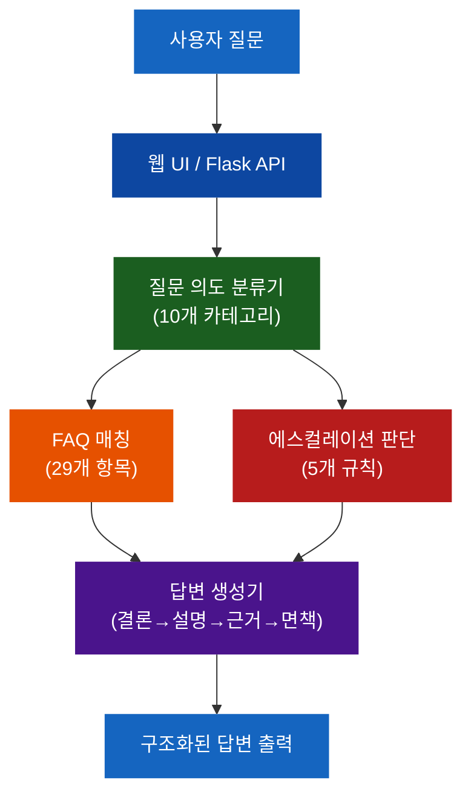
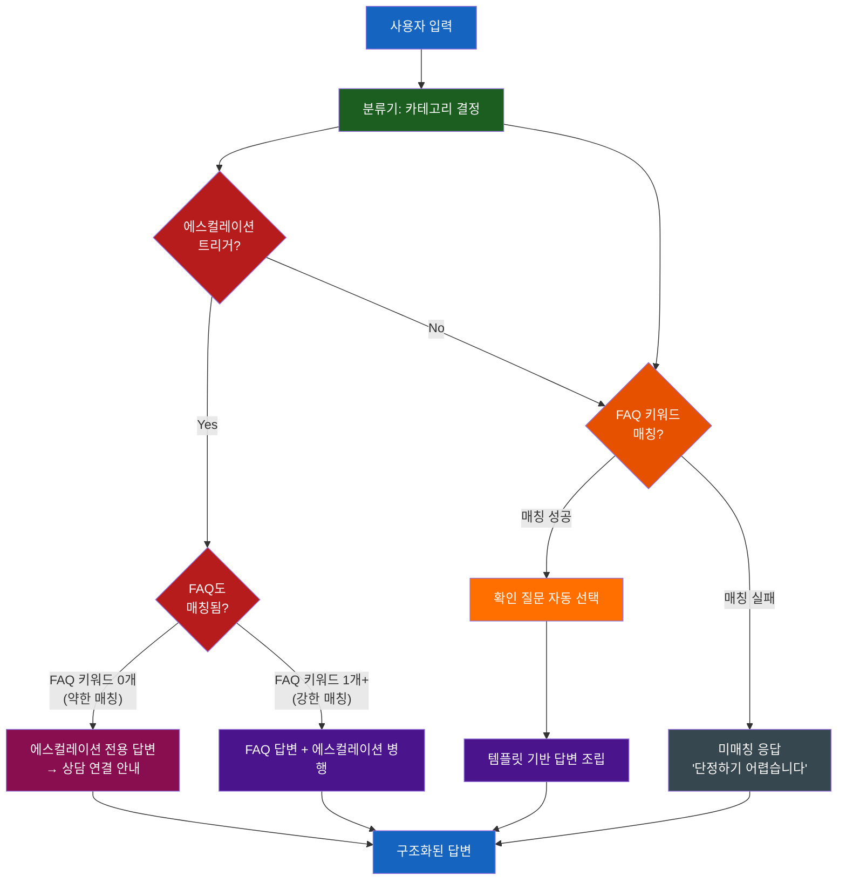
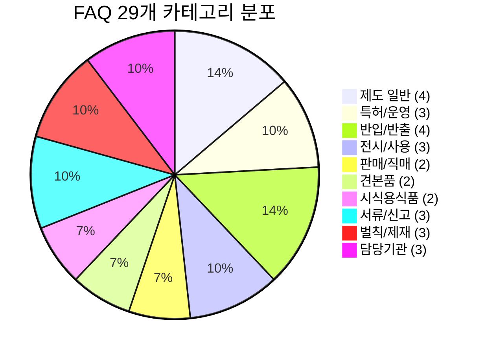
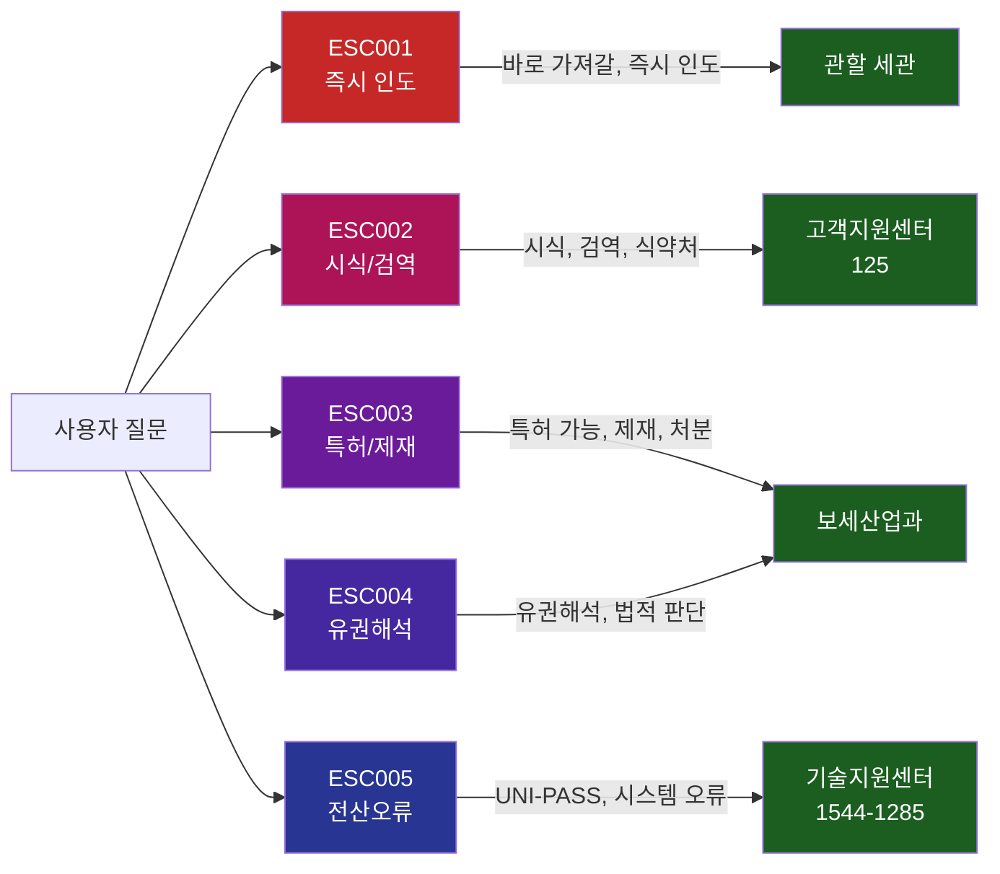
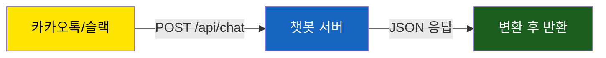
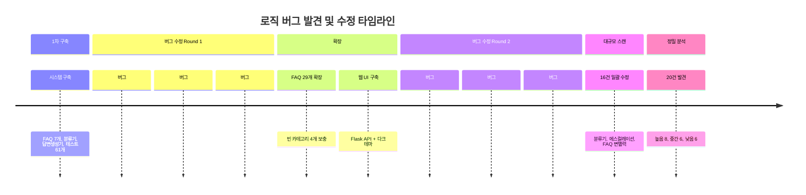

# 보세전시장 민원응대 챗봇

법제처 국가법령정보센터의 현행 법령과 관세청 공식 자료를 기반으로 한 보세전시장 민원응대 챗봇 시스템입니다.

---

## 시스템 아키텍처



## 질문 처리 흐름도



## 카테고리별 FAQ 분포



## 에스컬레이션 분기도



## 답변 구조 템플릿

```mermaid
block-beta
    columns 1
    block:header["문의하신 내용은 [카테고리]에 관한 사항입니다."]
    end
    block:conclusion["결론: 한 줄 결론 (핵심 답변)"]
    end
    block:explanation["설명: 1. 상세 설명 / 2. 실무상 주의사항"]
    end
    block:confirm["확인 사항: 외국물품 여부 / 행사 목적 / 세관 협의 여부"]
    end
    block:legal["근거: 관세법 제○조 / 보세전시장 운영에 관한 고시 제○조"]
    end
    block:disclaimer["안내: 일반적 안내용 설명, 최종 처리는 관할 세관 확인 필요"]
    end

    style header fill:#0D47A1,color:#fff
    style conclusion fill:#1565C0,color:#fff
    style explanation fill:#1976D2,color:#fff
    style confirm fill:#FF6F00,color:#fff
    style legal fill:#2E7D32,color:#fff
    style disclaimer fill:#546E7A,color:#fff
```

## 운영자 빠른 시작 가이드

### 1단계: 설치 (2분)

```bash
git clone https://github.com/sun475300-sudo/bonded-exhibition-chatbot-data.git
cd bonded-exhibition-chatbot-data
pip install -r requirements.txt
```

### 2단계: 실행

```bash
# 웹 챗봇
python web_server.py --port 8080
# → 브라우저에서 http://127.0.0.1:8080 접속

# 터미널 시뮬레이터
python simulator.py              # 대화형 모드
python simulator.py --test       # 자동 테스트
python simulator.py -q "질문"    # 단일 질문

# 테스트
python -m pytest tests/ -v       # 101개 테스트
```

### 3단계: 내 사이트에 적용

**방법 A. iframe 삽입 (가장 쉬움)**

```html
<iframe src="http://챗봇서버주소:8080"
        width="400" height="600"
        style="border:none; border-radius:12px; box-shadow:0 4px 24px rgba(0,0,0,0.15);">
</iframe>
```

**방법 B. 팝업 위젯 (복붙)**

`</body>` 바로 위에 붙여넣으면 우측 하단에 챗봇 버튼 생성:

```html
<!-- 보세전시장 챗봇 위젯 -->
<div id="chatbot-widget" style="position:fixed;bottom:24px;right:24px;z-index:9999;">
  <iframe id="chatbot-frame" src="http://챗봇서버주소:8080"
          style="display:none;width:400px;height:600px;border:none;border-radius:12px;
                 box-shadow:0 8px 32px rgba(0,0,0,0.3);"></iframe>
  <button onclick="
    var f=document.getElementById('chatbot-frame');
    f.style.display=f.style.display==='none'?'block':'none';
  " style="width:60px;height:60px;border-radius:50%;border:none;
           background:linear-gradient(135deg,#1565C0,#1E88E5);color:#fff;
           font-size:24px;cursor:pointer;box-shadow:0 4px 16px rgba(21,101,192,0.4);">
    B
  </button>
</div>
```

**방법 C. REST API 연동**

```
POST /api/chat    → 질문 처리 및 답변 반환
GET  /api/faq     → FAQ 29개 목록
GET  /api/config  → 카테고리, 연락처
GET  /api/health  → 서버 상태
```

```javascript
const res = await fetch('http://챗봇서버주소:8080/api/chat', {
  method: 'POST',
  headers: {'Content-Type': 'application/json'},
  body: JSON.stringify({query: '보세전시장이란?'})
});
const data = await res.json();
// data.answer, data.category, data.is_escalation
```

**방법 D. 카카오톡/슬랙 연동**



### FAQ/법령 데이터 수정

```
data/faq.json              ← FAQ 추가/수정
data/legal_references.json ← 법령 근거 업데이트
data/escalation_rules.json ← 에스컬레이션 규칙 변경
src/classifier.py          ← 분류 키워드 조정 (필요 시)
```

FAQ 추가 형식:
```json
{
  "id": "NEW01",
  "category": "GENERAL",
  "question": "새로운 질문?",
  "answer": "답변 내용...",
  "legal_basis": ["관세법 제○조"],
  "notes": "",
  "keywords": ["키워드1", "키워드2"]
}
```

수정 후 검증:
```bash
python -m pytest tests/ -v
python simulator.py --test
```

### 운영 시 주의사항

| 항목 | 내용 |
|------|------|
| 법령 업데이트 | 관세청 고시 개정 시 `data/` 내 JSON 파일 갱신 필요 |
| 면책 문구 | 모든 답변에 자동 포함됨, 제거 금지 |
| 에스컬레이션 | 5개 규칙에 해당하면 사람 상담 연결 안내 자동 출력 |
| CORS 설정 | 다른 도메인에서 API 호출 시 Flask-CORS 설치 필요 |
| HTTPS | 프로덕션 배포 시 nginx + SSL 인증서 적용 권장 |
| 프로덕션 서버 | `gunicorn -w 4 -b 0.0.0.0:8080 web_server:app` 권장 |

---

## 프로젝트 구조

```
bonded-exhibition-chatbot-data/
├── config/
│   ├── system_prompt.txt          # 챗봇 시스템 프롬프트
│   └── chatbot_config.json        # 챗봇 설정 (페르소나, 카테고리, 연락처)
├── data/
│   ├── faq.json                   # FAQ 데이터셋 (29개 항목)
│   ├── legal_references.json      # 법령 근거 데이터
│   └── escalation_rules.json      # 에스컬레이션 규칙 (5개 조건)
├── templates/
│   └── response_template.json     # 답변 포맷 템플릿
├── src/
│   ├── chatbot.py                 # 메인 챗봇 로직
│   ├── classifier.py              # 질문 의도 분류기 (10개 카테고리)
│   ├── response_builder.py        # 답변 생성기
│   ├── escalation.py              # 에스컬레이션 판단 로직
│   ├── data_validator.py          # 데이터 정합성 검증기
│   ├── validator.py               # 확인 질문 관리
│   └── utils.py                   # 유틸리티 함수
├── tests/                         # 테스트 101개
├── web/
│   └── index.html                 # 웹 챗봇 UI (다크 테마)
├── web_server.py                  # Flask 웹 서버
├── simulator.py                   # 터미널 챗봇 시뮬레이터
└── requirements.txt
```

## 핵심 법적 근거

| 법령 | 조문 | 내용 |
|------|------|------|
| 관세법 | 제190조 | 보세전시장 정의 |
| 관세법 | 제161조 | 견본품 반출 (세관장 허가) |
| 관세법 | 제269조 | 밀수출입죄 |
| 관세법 | 제183조 | 보세창고 |
| 관세법 시행령 | 제101조 | 판매용품의 면허전 사용금지 |
| 관세법 시행령 | 제102조 | 직매된 전시용품의 통관전 반출금지 |
| 관세청 고시 | 제2026-15호 | 보세전시장 운영에 관한 고시 |

## 버그 수정 이력



## 업데이트 내역

| 커밋 | 내용 |
|------|------|
| `446d9a2` | feat: 챗봇 전체 시스템 구축 (FAQ 7개, 분류기, 답변 생성기, 에스컬레이션, 테스트 61개) |
| `853bea3` | feat: FAQ 29개 확장, 분류기 강화, 데이터 검증기, 에지케이스 테스트 |
| `eb591f3` | feat: 웹 챗봇 인터페이스 구축 (Flask API + HTML/JS UI) |
| `a02838f` | fix: FAQ 매칭 로직 버그 + 웹 UI 전면 개선 (다크 테마, 구조화 렌더링) |
| `aaef67c` | fix: 분류기 키워드 정확도 개선 |
| `95d9eba` | fix: 대규모 버그 스캔 16건 일괄 수정 |
| `345eb74` | docs: 정밀 분석 결과 + 누락 법령 추가 |

## 라이선스

이 프로젝트의 법령 데이터는 법제처 국가법령정보센터 및 관세청 공식 자료를 참고하였습니다.
