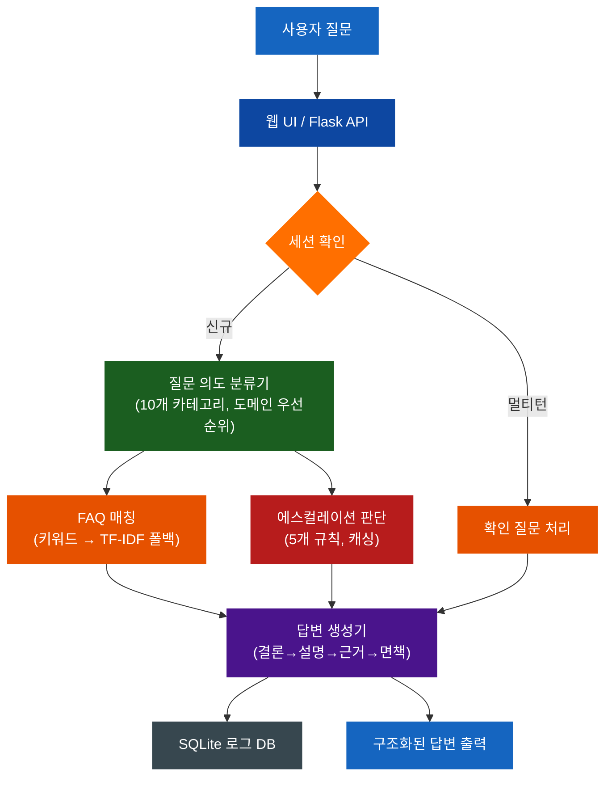
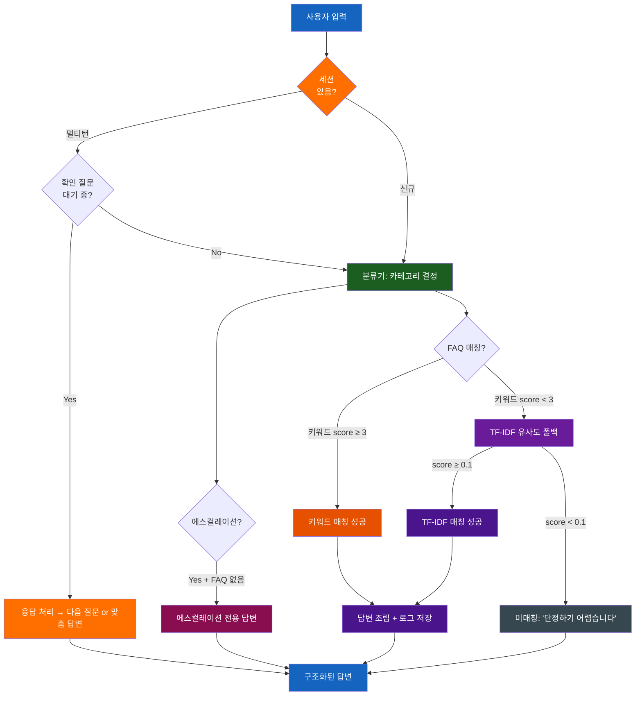
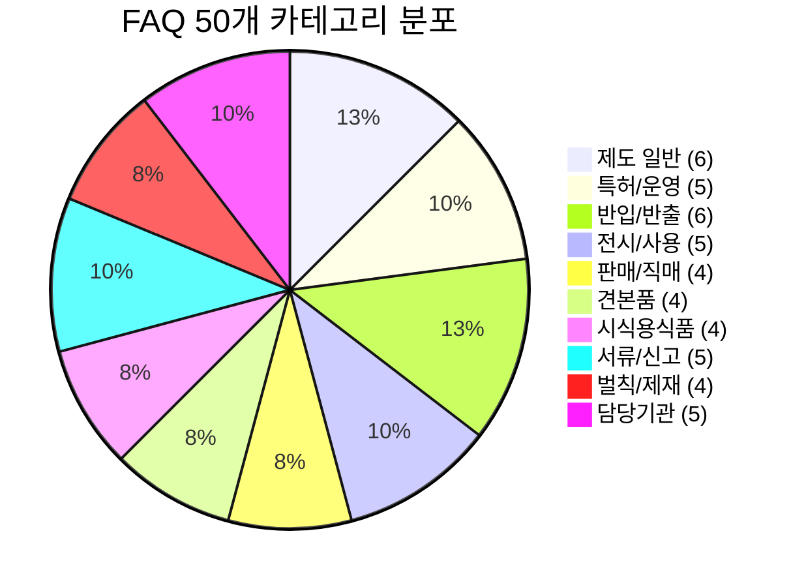
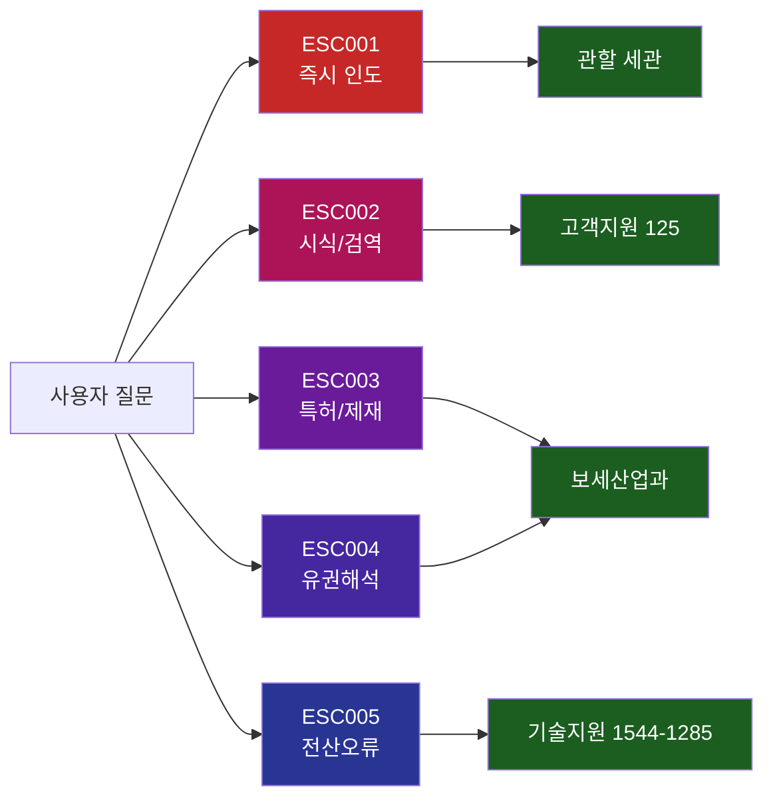
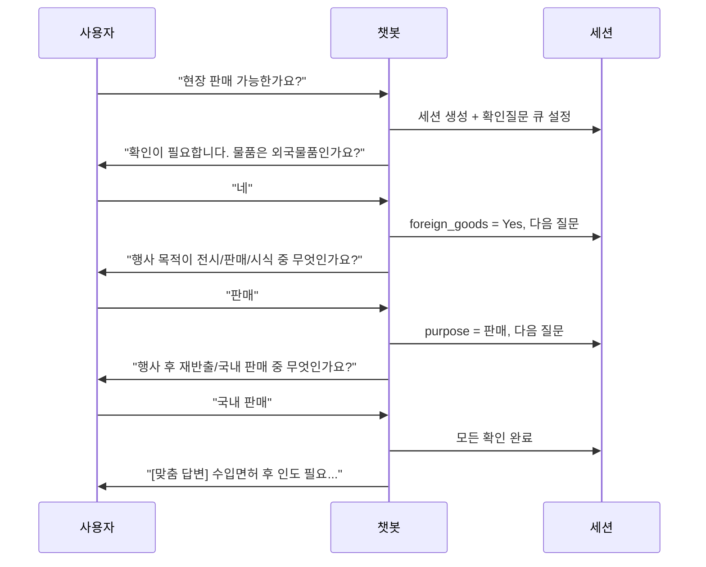
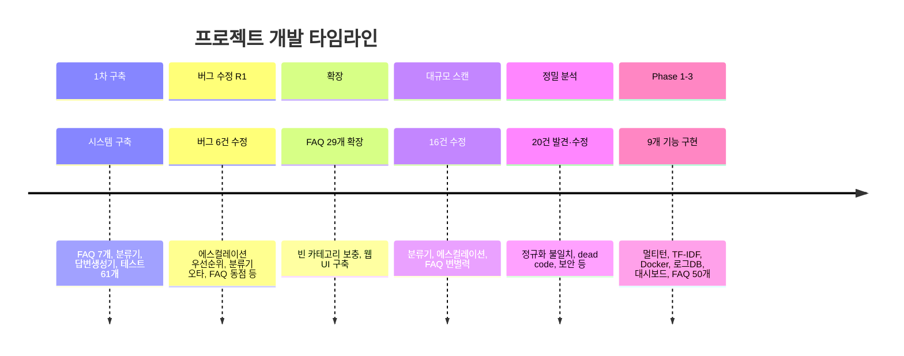

# 보세전시장 민원응대 챗봇

법제처 국가법령정보센터의 현행 법령과 관세청 공식 자료를 기반으로 한 보세전시장 민원응대 챗봇 시스템입니다.

---

## 주요 수치

| 항목 | 수치 |
|------|------|
| FAQ | 50개 (v3.0.0) |
| 질문 카테고리 | 10개 |
| 에스컬레이션 규칙 | 5개 |
| 테스트 | 187개 (전체 PASS) |
| 소스 파일 | 28개 |
| 커밋 | 15개 |

---

## 시스템 아키텍처



## 질문 처리 흐름도



## 카테고리별 FAQ 분포 (50개)



## 에스컬레이션 분기도



## 멀티턴 대화 흐름



---

## 빠른 시작

### 설치 (2분)

```bash
git clone https://github.com/sun475300-sudo/bonded-exhibition-chatbot-data.git
cd bonded-exhibition-chatbot-data
pip install -r requirements.txt
```

### 실행

```bash
# 웹 챗봇 (브라우저에서 http://127.0.0.1:8080)
python web_server.py --port 8080

# 관리자 대시보드 (http://127.0.0.1:8080/admin)

# 터미널 시뮬레이터
python simulator.py              # 대화형
python simulator.py --test       # 자동 테스트
python simulator.py -q "질문"    # 단일 질문

# Docker 배포
docker-compose up -d
```

### 테스트
```bash
python -m pytest tests/ -v       # 187개 테스트
```

---

## 프로젝트 구조

```
bonded-exhibition-chatbot-data/
├── config/
│   ├── system_prompt.txt          # 시스템 프롬프트
│   └── chatbot_config.json        # 설정 (페르소나, 카테고리, 연락처)
├── data/
│   ├── faq.json                   # FAQ 50개 (v3.0.0)
│   ├── legal_references.json      # 법령 근거 8건
│   └── escalation_rules.json      # 에스컬레이션 5규칙
├── templates/
│   └── response_template.json     # 답변 포맷
├── src/
│   ├── chatbot.py                 # 메인 로직 (키워드+TF-IDF 하이브리드)
│   ├── classifier.py              # 분류기 (10카테고리, 도메인 우선순위)
│   ├── similarity.py              # TF-IDF 유사도 매칭 (순수 Python)
│   ├── session.py                 # 멀티턴 세션 관리 (30분 만료)
│   ├── response_builder.py        # 답변 생성기 (면책 단일 관리)
│   ├── escalation.py              # 에스컬레이션 (캐싱, normalize)
│   ├── validator.py               # 확인 질문 (중복 방지)
│   ├── logger_db.py               # SQLite 질문 로그
│   ├── data_validator.py          # 데이터 정합성 검증
│   ├── kakao_adapter.py           # 카카오톡 어댑터
│   ├── llm_fallback.py            # LLM 하이브리드 폴백
│   ├── law_updater.py             # 법령 업데이트 감지
│   └── utils.py                   # 유틸리티
├── tests/                         # 187개 테스트
│   ├── test_chatbot.py            # 통합 테스트
│   ├── test_classifier.py         # 분류기
│   ├── test_similarity.py         # TF-IDF 매칭
│   ├── test_session.py            # 멀티턴 세션
│   ├── test_response_builder.py   # 답변 생성기
│   ├── test_escalation.py         # 에스컬레이션
│   ├── test_validator.py          # 확인 질문
│   ├── test_logger_db.py          # 로그 DB
│   ├── test_data_validator.py     # 데이터 정합성
│   ├── test_edge_cases.py         # 에지케이스
│   └── test_web_api.py            # 웹 API
├── web/
│   ├── index.html                 # 챗봇 UI (다크 테마)
│   └── admin.html                 # 관리자 대시보드
├── web_server.py                  # Flask 서버 (로깅, CORS, 에러핸들러)
├── simulator.py                   # 터미널 시뮬레이터
├── Dockerfile                     # Docker 이미지
├── docker-compose.yml             # Docker Compose
└── requirements.txt               # flask, flask-cors, pytest
```

## 사이트 적용 가이드

### A. iframe 삽입
```html
<iframe src="http://챗봇서버:8080" width="400" height="600"
        style="border:none;border-radius:12px;box-shadow:0 4px 24px rgba(0,0,0,0.15);"></iframe>
```

### B. 팝업 위젯 (복붙)
```html
<div id="chatbot-widget" style="position:fixed;bottom:24px;right:24px;z-index:9999;">
  <iframe id="chatbot-frame" src="http://챗봇서버:8080"
    style="display:none;width:400px;height:600px;border:none;border-radius:12px;
           box-shadow:0 8px 32px rgba(0,0,0,0.3);"></iframe>
  <button onclick="var f=document.getElementById('chatbot-frame');
    f.style.display=f.style.display==='none'?'block':'none';"
    style="width:60px;height:60px;border-radius:50%;border:none;
           background:linear-gradient(135deg,#1565C0,#1E88E5);color:#fff;
           font-size:24px;cursor:pointer;box-shadow:0 4px 16px rgba(21,101,192,0.4);">B</button>
</div>
```

### C. REST API

| 엔드포인트 | 메서드 | 설명 |
|-----------|--------|------|
| `/api/chat` | POST | 질문 처리 `{"query":"...", "session_id":"optional"}` |
| `/api/session/new` | POST | 세션 생성 |
| `/api/session/<id>` | GET | 세션 상태 |
| `/api/faq` | GET | FAQ 50개 목록 |
| `/api/config` | GET | 설정 정보 |
| `/api/health` | GET | 서버 상태 |
| `/api/admin/stats` | GET | 통계 |
| `/api/admin/logs` | GET | 최근 로그 |
| `/api/admin/unmatched` | GET | 미매칭 질문 |

### D. Docker 배포
```bash
docker-compose up -d
# http://서버IP:8080 (챗봇)
# http://서버IP:8080/admin (관리자)
```

---

## 핵심 법적 근거

| 법령 | 조문 | 내용 |
|------|------|------|
| 관세법 | 제190조 | 보세전시장 정의 |
| 관세법 | 제161조 | 견본품 반출 (세관장 허가) |
| 관세법 | 제269조 | 밀수출입죄 |
| 관세법 | 제183조 | 보세창고 |
| 관세법 시행령 | 제101조 | 판매용품의 면허전 사용금지 |
| 관세법 시행령 | 제102조 | 직매된 전시용품의 통관전 반출금지 |
| 관세법 | 제226조 | 세관장확인 |
| 관세청 고시 | 제2026-15호 | 보세전시장 운영에 관한 고시 |

## 개발 타임라인



## 업데이트 내역

| 커밋 | 내용 |
|------|------|
| `446d9a2` | feat: 챗봇 전체 시스템 구축 |
| `853bea3` | feat: FAQ 29개 확장, 분류기 강화 |
| `eb591f3` | feat: 웹 챗봇 인터페이스 구축 |
| `a02838f` | fix: FAQ 매칭 버그 + 웹 UI 개선 |
| `95d9eba` | fix: 대규모 버그 스캔 16건 |
| `4796ba6` | refactor: 정밀 분석 20건 전체 수정 |
| `a2aba9b` | feat: Phase 1-3 전체 구현 (멀티턴, Docker, 로그DB, 대시보드 등) |
| `e3780c6` | feat: FAQ 50개 확장 + TF-IDF 폴백 통합 |

## 라이선스

이 프로젝트의 법령 데이터는 법제처 국가법령정보센터 및 관세청 공식 자료를 참고하였습니다.
