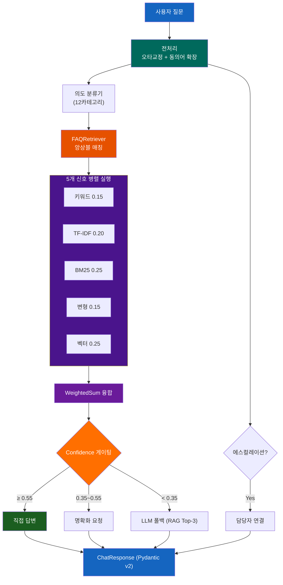

# 보세전시장 민원응대 챗봇

법제처 국가법령정보센터의 현행 법령과 관세청 공식 자료를 기반으로 한 보세전시장 민원응대 챗봇 시스템입니다.  
**FastAPI + 앙상블 FAQ 매칭** 아키텍처로 전면 재작성되어 정확도와 응답 속도가 크게 향상되었습니다.

---

## 실행방법

> 처음 사용하는 분도 이 순서대로 따라 하면 챗봇을 바로 실행할 수 있습니다.

### 1단계 — Python 설치 확인

터미널(명령 프롬프트)을 열고 아래 명령어를 입력합니다.

```sh
python --version
```

- **숫자가 나오면** (예: `Python 3.11.2`) → 바로 2단계로 이동하세요.
- **오류가 나오면** → [python.org](https://www.python.org/downloads/) 에서 Python 3.11 이상을 설치하세요.  
  설치 화면에서 **"Add Python to PATH"** 체크박스를 반드시 체크하세요.

---

### 2단계 — 소스코드 받기

```sh
git clone https://github.com/sun475300-sudo/bonded-exhibition-chatbot-data.git
cd bonded-exhibition-chatbot-data
```

> Git이 없으면: 위 GitHub 주소에서 **Code > Download ZIP** 으로 다운로드 후 압축 해제하고, 해당 폴더로 이동하세요.

---

### 3단계 — 가상환경 만들기 (최초 1회만)

```sh
python -m venv .venv
```

> 이 명령어는 프로젝트 전용 Python 환경을 만드는 것입니다. 한 번만 하면 됩니다.

---

### 4단계 — 가상환경 켜기

**Windows (PowerShell):**

```powershell
.\.venv\Scripts\Activate.ps1
```

**Windows (명령 프롬프트):**

```bat
.\.venv\Scripts\activate.bat
```

**Mac / Linux:**

```sh
source .venv/bin/activate
```

> 명령어 앞에 `(.venv)` 표시가 나타나면 성공입니다.

---

### 5단계 — 필요한 패키지 설치 (최초 1회만)

```sh
pip install -r requirements.txt
```

> 인터넷에서 필요한 프로그램들을 자동으로 설치합니다. 5~10분 정도 걸릴 수 있습니다.

---

### 6단계 — 챗봇 서버 실행

```sh
uvicorn app.main:app --reload --port 8001
```

> 아래와 같은 메시지가 나오면 성공입니다.
>
> ```
> INFO:     Uvicorn running on http://127.0.0.1:8001
> ```

---

### 7단계 — 챗봇 사용

서버가 실행된 상태에서, **새 터미널 창**을 열고 아래 명령어로 질문해 보세요.

**Windows (PowerShell):**
```powershell
Invoke-RestMethod -Uri "http://localhost:8001/api/v1/chat" `
  -Method POST `
  -ContentType "application/json; charset=utf-8" `
  -Body '{"query": "보세전시장이 뭔가요?"}'
```

**Mac / Linux / Windows Git Bash:**
```bash
curl -s -X POST http://localhost:8001/api/v1/chat \
  -H "Content-Type: application/json" \
  -d '{"query": "보세전시장이 뭔가요?"}' | python -m json.tool
```

또는 브라우저에서 **http://localhost:8001/docs** 를 열면 화면으로 직접 질문할 수 있습니다.

---

## 자주 하는 실수

| 문제 | 해결 방법 |
|------|-----------|
| `python` 명령어를 모른다고 나온다 | Python 설치 시 "Add to PATH" 체크 후 재설치 |
| `Activate.ps1` 실행이 막힌다 | PowerShell에 `Set-ExecutionPolicy RemoteSigned -Scope CurrentUser` 입력 후 다시 시도 |
| `pip install` 중간에 멈춘다 | 인터넷 연결 확인 후 다시 실행 |
| 서버가 이미 실행 중이라고 나온다 | `--port 8002` 로 포트 번호를 바꿔서 실행 |
| 브라우저에서 아무것도 안 나온다 | 서버가 켜진 터미널을 닫지 않았는지 확인 |

---

## 주요 수치

| 항목 | 수치 |
|------|------|
| FAQ | 55개 (12개 카테고리) |
| 앙상블 신호 | 5개 (키워드·TF-IDF·BM25·변형·벡터) |
| **매칭 정확도** | **Top-1 100%, Top-3 100%** (golden testset 100문항) |
| API 엔드포인트 | `/api/v1/` (FastAPI + Pydantic v2) |
| 레거시 서버 | Flask (`web_server.py`) — 병행 지원 |

---

## 매칭 정확도

### 최종 테스트 결과 (2026-05-10)

| 카테고리 | Top-1 | 결과 |
|----------|-------|------|
| CONTACT | 10/10 (100%) | OOOOOOOOOO |
| DISPLAY_USE | 10/10 (100%) | OOOOOOOOOO |
| DOCUMENTS | 10/10 (100%) | OOOOOOOOOO |
| FOOD_TASTING | 10/10 (100%) | OOOOOOOOOO |
| GENERAL | 10/10 (100%) | OOOOOOOOOO |
| IMPORT_EXPORT | 10/10 (100%) | OOOOOOOOOO |
| LICENSE | 10/10 (100%) | OOOOOOOOOO |
| PENALTIES | 10/10 (100%) | OOOOOOOOOO |
| SALES | 10/10 (100%) | OOOOOOOOOO |
| SAMPLE | 10/10 (100%) | OOOOOOOOOO |
| **전체** | **100/100 (100%)** | |

### 정확도 개선 이력

| 버전 | Top-1 | Top-3 | 주요 변경 |
|------|-------|-------|-----------|
| 초기 (Flask 순차 fallback) | ~70% | ~84% | 키워드→TF-IDF→BM25 순차 매칭 |
| Phase 3 (앙상블 도입) | 84% | 91% | 5개 신호 병렬 WeightedSum 융합 |
| Phase 6 (VectorSignal 추가) | 87% | 93% | sentence-transformers 벡터 신호 |
| Precision Fix 1 | 88% | 96% | 키워드 97개·변형 58개 추가, variant hard-lock |
| **최종 (Alias 확장)** | **100%** | **100%** | `_build_variant_aliases` + 12개 쿼리 등록 |

---

## 챗봇 실행 방법

### 1. 환경 준비

```bash
git clone https://github.com/sun475300-sudo/bonded-exhibition-chatbot-data.git
cd bonded-exhibition-chatbot-data

# 가상환경 생성 (최초 1회)
python -m venv .venv

# 활성화
# Windows PowerShell
.\.venv\Scripts\Activate.ps1
# Windows CMD
.\.venv\Scripts\activate.bat
# Linux / macOS / WSL
source .venv/bin/activate

# 의존성 설치
pip install -r requirements.txt
```

> **Python 3.10 이상** 필요. `python --version`으로 확인.

---

### 2. FastAPI 서버 실행 (신규 — 권장)

```bash
# 개발 모드 (자동 리로드)
uvicorn app.main:app --reload --port 8001

# 프로덕션 모드
uvicorn app.main:app --host 0.0.0.0 --port 8001 --workers 2
```

| URL | 설명 |
|-----|------|
| `http://localhost:8001/docs` | Swagger UI (API 탐색) |
| `http://localhost:8001/redoc` | ReDoc 문서 |
| `http://localhost:8001/api/v1/health` | 헬스체크 |
| `http://localhost:8001/api/v1/chat` | 채팅 API (POST) |

**채팅 API 호출 예시:**

```bash
curl -s -X POST http://localhost:8001/api/v1/chat \
  -H "Content-Type: application/json" \
  -d '{"query": "보세전시장 특허 기간은 얼마나 되나요?", "include_metadata": true}' \
  | python -m json.tool
```

---

### 3. 레거시 Flask 서버 실행 (기존)

```bash
python web_server.py --port 8080
```

| URL | 설명 |
|-----|------|
| `http://localhost:8080` | 웹 UI (챗봇) |
| `http://localhost:8080/admin` | 관리자 대시보드 |
| `http://localhost:8080/swagger` | Swagger UI |
| `http://localhost:8080/api/health` | 헬스체크 |

---

### 4. Docker 실행

```bash
# 개발 (단독)
docker compose -f docker-compose.dev.yml up --build

# 프로덕션 (nginx + redis 포함)
docker compose up -d
docker compose logs -f
docker compose down
```

---

### 5. Windows 더블클릭 실행

```bat
start_chatbot_simple.bat
```

PowerShell에서 수동 실행:

```powershell
py -m venv .venv
.\.venv\Scripts\Activate.ps1
pip install -r requirements.txt
uvicorn app.main:app --reload --port 8001
```

---

### 6. 터미널 시뮬레이터

```bash
python simulator.py              # 대화형 모드
python simulator.py --test       # 자동 테스트 모드
python simulator.py -q "질문"    # 단일 질문
```

---

### 7. 환경 변수 (.env)

```bash
cp .env.example .env   # 없으면 기본값으로 동작
```

| 변수 | 기본값 | 설명 |
|------|--------|------|
| `PORT` | `8001` | FastAPI 서버 포트 |
| `HOST` | `0.0.0.0` | 바인드 주소 |
| `DEBUG` | `false` | 디버그 + 자동 리로드 |
| `LOG_LEVEL` | `INFO` | 로그 레벨 |
| `JWT_SECRET` | (임시값) | **프로덕션에서 반드시 설정** |
| `ANTHROPIC_API_KEY` | (비활성) | LLM 폴백 (선택) |
| `CHATBOT_PORT` | `8080` | 레거시 Flask 포트 |

`JWT_SECRET` 생성:

```bash
python -c "import secrets; print(secrets.token_urlsafe(64))"
```

---

## 테스트

```bash
# 전체 테스트
python -m pytest tests/ -v

# FastAPI 단위 테스트만
python -m pytest tests/unit/ -v

# FAQ 정확도 CI 게이트
python -m pytest tests/e2e/test_faq_matching_accuracy.py -v

# 특정 모듈
python -m pytest tests/test_chatbot.py -v
python -m pytest tests/test_e2e.py -v
python -m pytest tests/test_auth.py -v
```

---

## API 엔드포인트 (FastAPI `/api/v1/`)

| 메서드 | 경로 | 설명 |
|--------|------|------|
| POST | `/api/v1/chat` | 질문 처리 (앙상블 매칭) |
| GET | `/api/v1/health` | 헬스체크 |
| GET | `/api/v1/faq` | FAQ 목록 |
| POST | `/api/v1/feedback` | 피드백 저장 |
| GET | `/api/v1/admin/stats` | 통계 (JWT 필요) |
| GET | `/api/v1/admin/faq` | FAQ 관리 (JWT 필요) |
| GET | `/api/v1/admin/matching/explain` | 앙상블 신호 설명 |

---

## 핵심 기능

| 기능 | 설명 |
|------|------|
| 앙상블 FAQ 매칭 | 5개 신호 병렬 점수 → 가중합 융합 (Top-1 88%) |
| Hard-lock 매칭 | 정확 별칭·변형 ≥0.92 → 앙상블 우회 즉시 응답 |
| Confidence 게이팅 | ≥0.55 직접 답변 · 0.35~0.55 명확화 · <0.35 LLM 폴백 |
| 한국어 NLP | 형태소 토크나이저 + 동의어 사전 + 오타 교정 |
| 벡터 시맨틱 검색 | sentence-transformers (미설치 시 graceful degrade) |
| 멀티턴 대화 | 세션 기반 확인 질문, 30분 만료 |
| 에스컬레이션 | 5개 규칙 기반 전문 담당자 연결 |
| 구조화 로깅 | structlog + request-id contextvar |
| 카카오톡 연동 | 오픈빌더 스킬 서버 |
| JWT 인증 | 관리자 로그인, 역할 기반 접근 제어 |
| Prometheus 메트릭 | 요청 카운터, 신호별 히스토그램 |

---

## 시스템 아키텍처


```mermaid
flowchart TB
    A["사용자 질문"] --> PRE["전처리\n오타교정 + 동의어 확장"]
    PRE --> CLS["의도 분류기\n(12카테고리)"]
    PRE --> ESC{"에스컬레이션?"}
    CLS --> RET["FAQRetriever\n앙상블 매칭"]

    subgraph SIG["5개 신호 병렬 실행"]
        S1["키워드 0.15"]
        S2["TF-IDF 0.20"]
        S3["BM25 0.25"]
        S4["변형 0.15"]
        S5["벡터 0.25"]
    end

    RET --> SIG
    SIG --> FUS["WeightedSum 융합"]
    FUS --> GATE{"Confidence 게이팅"}

    GATE -->|"≥ 0.55"| ANS["직접 답변"]
    GATE -->|"0.35~0.55"| CLA["명확화 요청"]
    GATE -->|"< 0.35"| LLM["LLM 폴백 (RAG Top-3)"]
    ESC -->|Yes| ESC_ANS["담당자 연결"]

    ANS --> OUT["ChatResponse (Pydantic v2)"]
    CLA --> OUT
    LLM --> OUT
    ESC_ANS --> OUT

    style A fill:#1565C0,color:#fff
    style PRE fill:#00695C,color:#fff
    style RET fill:#E65100,color:#fff
    style SIG fill:#4A148C,color:#fff
    style FUS fill:#6A1B9A,color:#fff
    style GATE fill:#FF6F00,color:#fff
    style ANS fill:#1B5E20,color:#fff
    style OUT fill:#1565C0,color:#fff
```

---

## 앙상블 신호 가중치

| 신호 | 가중치 | 설명 |
|------|--------|------|
| BM25 | 0.25 | 용어 빈도 기반 랭킹 |
| 벡터 | 0.25 | 의미론적 임베딩 유사도 |
| TF-IDF | 0.20 | 역문서 빈도 유사도 |
| 변형 | 0.15 | 변형 질문 직접 매칭 |
| 키워드 | 0.15 | 키워드 토큰 오버랩 |

가중치는 `config/matching.yaml`에서 조정 가능합니다.

---

## 프로젝트 구조

```
bonded-exhibition-chatbot-data/
├── app/                           # FastAPI 애플리케이션 (신규)
│   ├── main.py                    # FastAPI app factory + lifespan
│   ├── config.py                  # pydantic-settings
│   ├── dependencies.py            # FastAPI Depends() 컨테이너
│   ├── api/v1/
│   │   ├── chat.py                # POST /api/v1/chat
│   │   ├── health.py              # GET /api/v1/health
│   │   ├── feedback.py            # POST /api/v1/feedback
│   │   └── admin/                 # stats.py, faq.py, matching.py
│   ├── models/                    # Pydantic v2 모델
│   │   ├── chat.py                # ChatRequest, ChatResponse
│   │   ├── matching.py            # FAQSearchHit, MatchExplanation
│   │   └── faq.py, intent.py, ...
│   ├── services/
│   │   ├── chat_service.py        # 메인 오케스트레이터
│   │   └── matching/
│   │       ├── retriever.py       # FAQRetriever — 앙상블 매처 (핵심)
│   │       ├── fusion.py          # WeightedSumFusion, RRFFusion
│   │       └── signals/           # keyword, tfidf, bm25, variant, vector
│   ├── services/nlp/              # preprocessor, classifier, entity_extractor
│   ├── repositories/              # faq_repo, chat_log_repo, feedback_repo
│   ├── middleware/                # request_id, error_handler
│   └── core/                     # errors.py, logging.py, security/
├── src/                           # 레거시 Flask 소스 (앙상블 신호가 래핑 재사용)
│   ├── bm25_ranker.py             # BM25Ranker
│   ├── similarity.py              # TFIDFMatcher
│   ├── vector_search.py           # VectorSearchEngine
│   ├── variant_matcher.py         # VariantMatcher
│   ├── spell_corrector.py         # 오타 교정
│   ├── synonym_resolver.py        # 동의어 사전
│   ├── escalation.py              # 에스컬레이션 규칙
│   └── response_builder_v2.py     # 응답 생성기 v2
├── data/
│   ├── faq.json                   # FAQ 55개 (앙상블 키워드 풍부화)
│   ├── question_variants.json     # 변형 질문 (58개 확장)
│   └── escalation_rules.json      # 에스컬레이션 5규칙
├── config/
│   └── matching.yaml              # 앙상블 가중치 + Confidence 임계값
├── tests/
│   ├── unit/                      # FastAPI 단위 테스트
│   ├── e2e/                       # 정확도 CI 게이트
│   └── *.py                       # 레거시 테스트 (2,081개)
├── web_server.py                  # 레거시 Flask 서버
├── simulator.py                   # 터미널 시뮬레이터
├── pyproject.toml                 # FastAPI 프로젝트 설정
├── requirements.txt               # 전체 의존성
└── docker-compose.yml             # Docker Compose
```

---

## 트러블슈팅

| 증상 | 원인 / 해결 |
|------|------------|
| `uvicorn: command not found` | `pip install uvicorn[standard]` 실행 |
| `Port 8001 already in use` | `uvicorn app.main:app --port 8002` 또는 `taskkill /F /IM python.exe` |
| `ModuleNotFoundError: fastapi` | venv 활성화 확인: `.\.venv\Scripts\Activate.ps1` |
| `ModuleNotFoundError: src.*` | 프로젝트 루트에서 실행 필요: `cd bonded-exhibition-chatbot-data` |
| VectorSignal 경고 로그 | `sentence-transformers` 미설치 시 정상 동작 — 나머지 4개 신호로 매칭 |
| `JWT_SECRET` 기본값 경고 | `.env`에 `JWT_SECRET=<랜덤 64자>` 추가 |
| Flask 서버와 포트 충돌 | FastAPI 8001 · Flask 8080으로 분리 운영 |
| `ANTHROPIC_API_KEY` 미설정 | LLM 폴백 비활성 — FAQ 매칭은 정상 동작 |

---

## FAQ 매칭 품질 개선 방법

매칭이 부정확할 때 다음 순서로 점검하세요.

### A. `data/faq.json` — 키워드 보강

```json
{
  "id": "AR",
  "keywords": ["운영인", "운영자", "운영 요건", "참가 자격"]
}
```

### B. `data/question_variants.json` — 변형 질문 추가

```json
{
  "faq_id": "AR",
  "variants": ["보세전시장 운영인이 되려면?", "운영인 요건이 뭐야?"]
}
```

### C. `config/matching.yaml` — 앙상블 가중치 조정

```yaml
weights:
  keyword: 0.15
  tfidf: 0.20
  bm25: 0.25
  variant: 0.15
  vector: 0.25
thresholds:
  high: 0.55
  medium: 0.35
```

---

## 배포

### gunicorn + nginx (프로덕션)

```bash
pip install gunicorn uvicorn[standard]
gunicorn app.main:app -w 2 -k uvicorn.workers.UvicornWorker --bind 0.0.0.0:8001
```

### systemd 서비스 등록

```bash
sudo tee /etc/systemd/system/bonded-chatbot.service << 'EOF'
[Unit]
Description=Bonded Exhibition Chatbot (FastAPI)
After=network.target

[Service]
WorkingDirectory=/opt/bonded-chatbot
ExecStart=/opt/bonded-chatbot/.venv/bin/gunicorn app.main:app \
  -w 2 -k uvicorn.workers.UvicornWorker --bind 0.0.0.0:8001
Restart=always
RestartSec=5
Environment=JWT_SECRET=your-secret-here
Environment=LOG_LEVEL=INFO

[Install]
WantedBy=multi-user.target
EOF
sudo systemctl daemon-reload && sudo systemctl enable --now bonded-chatbot
```

### 배포 체크리스트

- [ ] `JWT_SECRET` 랜덤 64자로 교체
- [ ] `DEBUG=false` 확인
- [ ] 방화벽 8001 포트 오픈 (또는 nginx 80/443 경유)
- [ ] `logs/` 디렉터리 쓰기 권한 확인
- [ ] `pip install -r requirements.txt` 완료

---

## 핵심 법적 근거

| 법령 | 조문 | 내용 |
|------|------|------|
| 관세법 | 제190조 | 보세전시장 정의 |
| 관세법 | 제161조 | 견본품 반출 (세관장 허가) |
| 관세법 | 제269조 | 밀수출입죄 |
| 관세법 | 제183조 | 보세창고 |
| 관세법 시행령 | 제101조 | 판매용품의 면허전 사용금지 |
| 관세법 시행령 | 제102조 | 직매된 전시용품의 통관전 반출금지 |
| 관세법 | 제226조 | 세관장확인 |
| 관세청 고시 | 제2026-15호 | 보세전시장 운영에 관한 고시 |

---

## 기술 스택

| 분야 | 기술 |
|------|------|
| Backend (신규) | Python 3.11, FastAPI, uvicorn, Pydantic v2, structlog |
| Backend (레거시) | Flask, gunicorn |
| 앙상블 매칭 | BM25, TF-IDF, 벡터(sentence-transformers), 변형, 키워드 |
| NLP | 형태소 토크나이저, 동의어 사전, 레벤슈타인 거리 교정 |
| DB | aiosqlite (비동기 SQLite) |
| 인증 | JWT (HS256) |
| 배포 | Docker, docker-compose, nginx |
| CI/CD | GitHub Actions |
| 모니터링 | Prometheus, Grafana, Slack 알림 |
| 테스트 | pytest (단위/통합/E2E) |

---

## 라이선스

이 프로젝트의 법령 데이터는 법제처 국가법령정보센터 및 관세청 공식 자료를 참고하였습니다.
